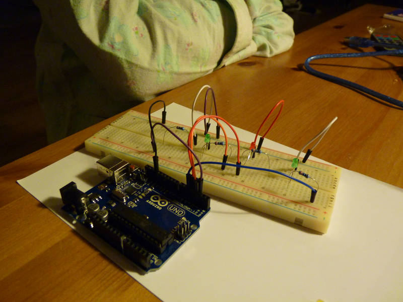

[← zpět na zápisky z Arduino projektů](../index.md)

# Programované  blikače
Rozšířená verze ručních blikačů, jen už budeme programovat. Jednoduché vrstvení příkazů za sebou (sekvence), osahání si Arduino IDE, nahrávání programu do Arduina. Napájení Arduina z USB nebo z baterie.

Různá zapojení automatických blikačů. Základní struktura programu (nastavení v `setup()` a dokola opakovaný kód v `loop()`). Časování pomocí `delay()`, příkazy `digitalWrite()`, `pinMode()`, `HIGH`, `LOW`.

Vysvětlení, co je to `GND`, `VCC`, jaké typy napětí kde na Arduinu najdeme.

## Co je potřeba umět
Základy zapojování LED.

## Foto
Fotografie nezobrazuje přesně typ automatického blikače, který je dále popsán kódem.



## Hardware
* dostatek různě barevných LED, některé se asi spálí
* rezistory 220&nbsp;Ω - 330&nbsp;Ω
* volitelně spínače
## Schéma zapojení

## Program
[blikac.ino](blikac.ino) - kód je napsán osmiletým dítětem
``` c++

```

## Možná vylepšení
* Nejrůznější variace blikačů, světla železničního přejezdu, nebo [semafor](../semafor/semafor.md) či [Night rider](../night_rider/night_rider.md).

## Poznatky
V prvních chvílích není ani tak důležité, aby děti rozuměly všemu, co se v kódu píše, ale aby to blikalo.