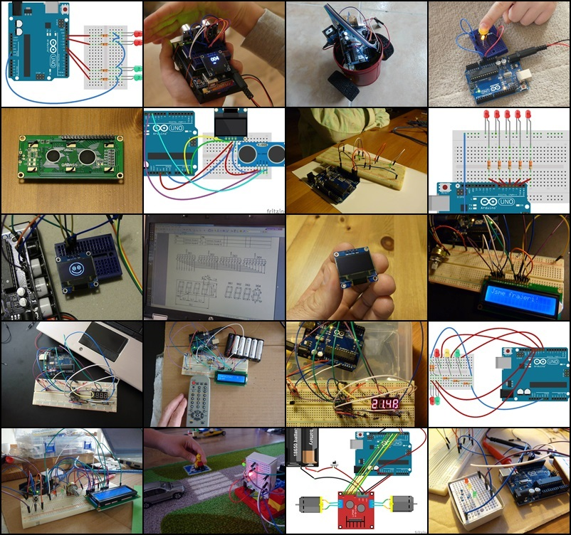

# Naše Arduino projekty
**Rozhodl jsem se sepsat projekty, které provádím se svými dětmi a elektronikou.** Úkoly jsou různě obtížné, začali jsme někdy v 5 letech, postupně se prokousáváme dále, jak věkem, tak obsahem.

[Literatury k Arduinu](https://arduino.cz/tag/ebook/) je všude dost, ale konkrétních příkladů co zkoušet s dětmi, už je podstatně méně. Nejsem žádný expert na elektroniku, ale snažím se ji nabídnout i těm nejmenším dětem tak, aby je to bavilo.

Jde o rodinné zápisky, které slouží primárně proto, aby se mé děti mohly k úlohám vracet, respektive je sdílet se svými kamarády a podobně.

> **Pozor, zápisky stále s dětmi doplňujeme!**



## Obecné 
Všechny nápady se týkají Arduina, což nutně nemusí být Uno R3, ale klidně i Pro mini a podobné. Pokud jsme použili jiný mikrokontroler, uvádím to. Součátky je možné nakupovat v ČR i v zahraničí (obvykle levněji). SW programujeme v [Arduino IDE](https://www.arduino.cc/en/main/software). Pro kreslení schémat využíváme [Fritzing](http://fritzing.org).

Ve všech projektech popisuji seznam součástek, ale Arduino board mezi nimi chybí, nechtěl jsem to jen neustále opakovat - prakticky všechny jsou za využití Arduina. Stejně tak neuvádím, že potřebujeme k projektu vodiče, nepájivé pole či napájení. Potřebujeme vždy.

## Řešené potíže
Sem si zapisujeme, co nás kde potkalo. Převážně jde o potíže s operačním systémem a HW počítače.

### "Permission denied" při pokusu nahrát program do Arduina na Linuxu
Uživatel musí být členem skupiny `dialout`.
``` bash
$ sudo usermod -aG dialout <user>
```

## Hraní s LEDkami
* [Ruční blikače](rucni_blikace/rucni_blikace.md)
* [Automatické blikače](automaticke_blikace/automaticke_blikace.md)
* [Semafor](semafor/semafor.md)
* [Knight rider](knight_rider/knight_rider.md)
* Žížala
* RGB LED

## Ovládnutí displejů
* [Znakový LCD displej](lcd/lcd.md)
* [OLED](oled/oled.md)

## Infra
* Zmapování domácích vysílačů
* Infra a LED

## Čidla
* [Teploměr se 7 segmentovým LED](teplomer/teplomer.md)
* [Ultrazvukové měření vzdálenosti s OLED](meric_vzdalenosti/meric_vzdalenosti.md)
* Vlhkost půdy
* Vlhkost vzduchu, teplota, nadmořská výška

## Ovládání
* [Joystick](joystick/joystick.md)

## Hry
* [Zkoušení matematiky](infra_matika/infra_matika.md)
* Znalostní zkoušetko

## [Robopixle](robopixle/robopixle.md)

## Plánujeme
_(jinými slovy máme rozmyšleno, součástky jsou na cestě a nebo zrovna děláme něco jiného)_
* Domovní zvonek na střídavých 20&nbsp;V se dvěma melodiemi
* Čidlo vlhkosti a teploty do koupelny se zvukovou signalizací pro zavření větracího okna
* Světelná infra závora pro blbnutí na zahradě
* Měření spotřeby vody v domě v reálném čase
