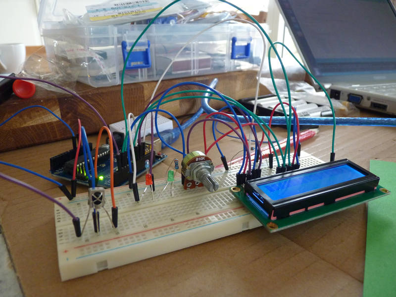
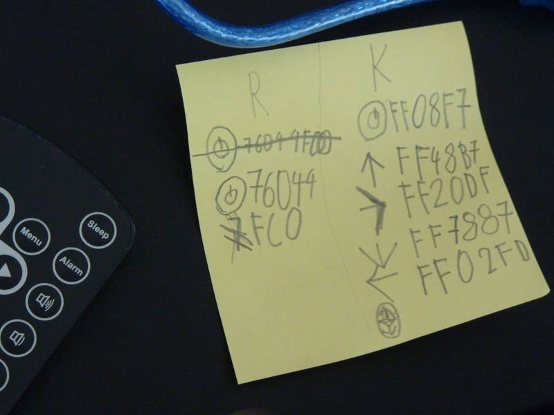
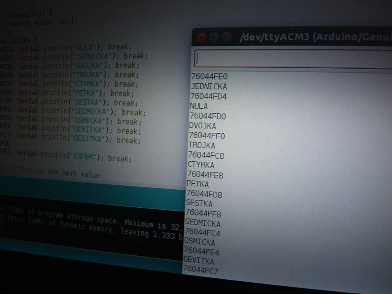
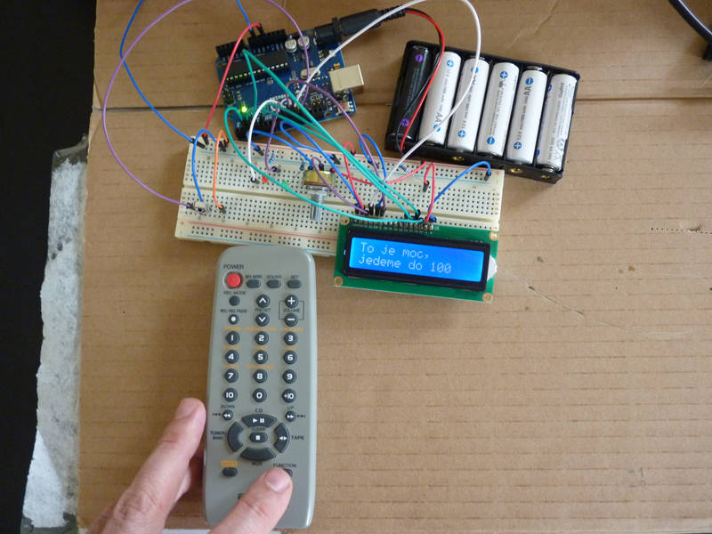
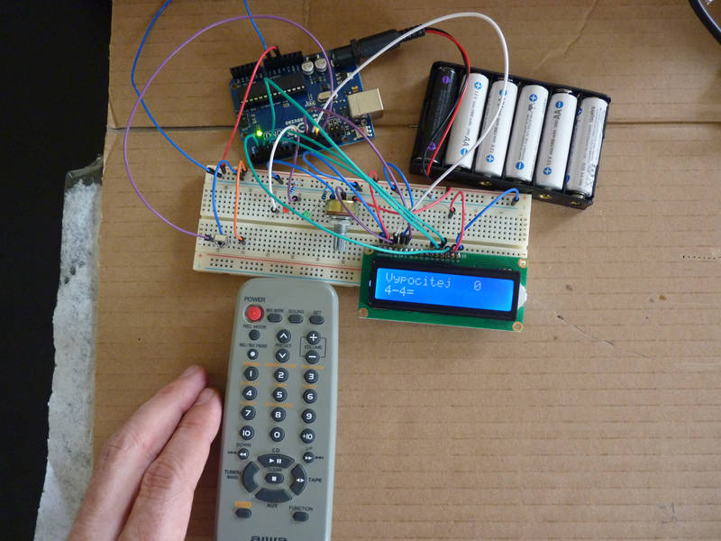
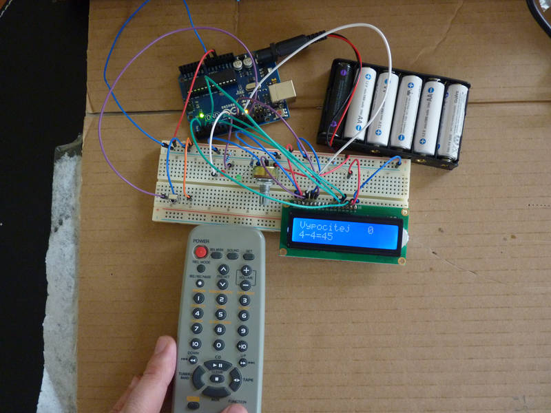
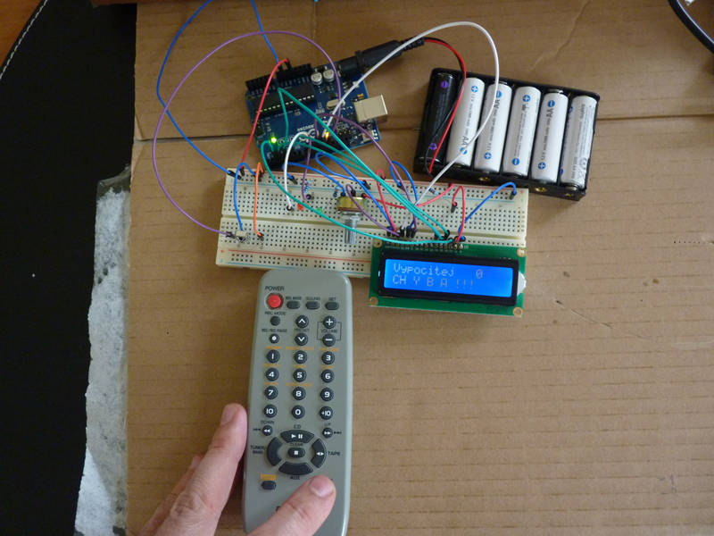
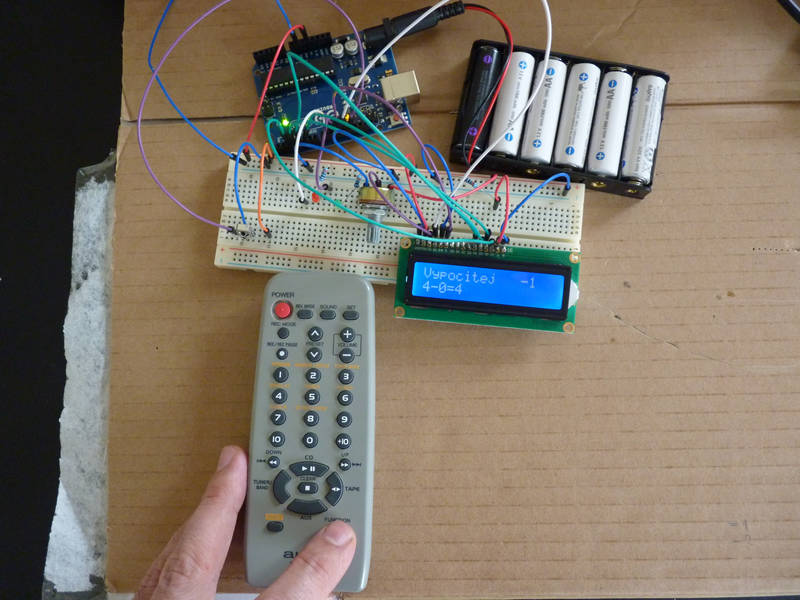
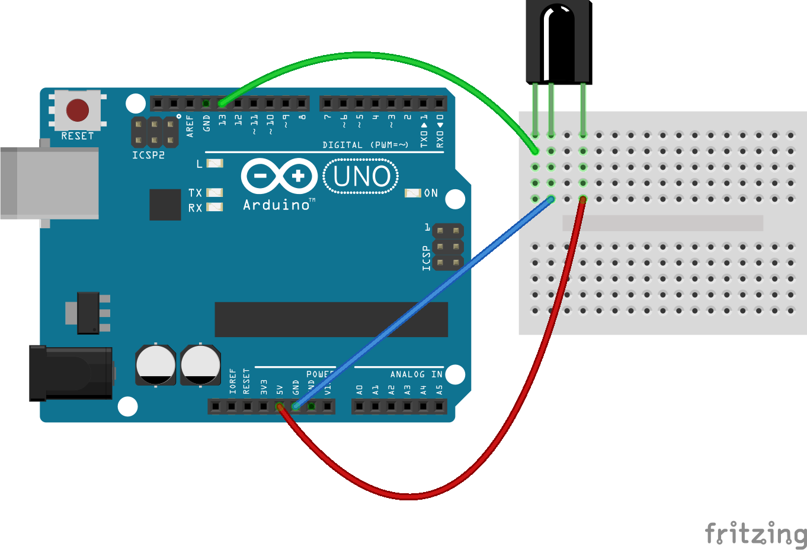
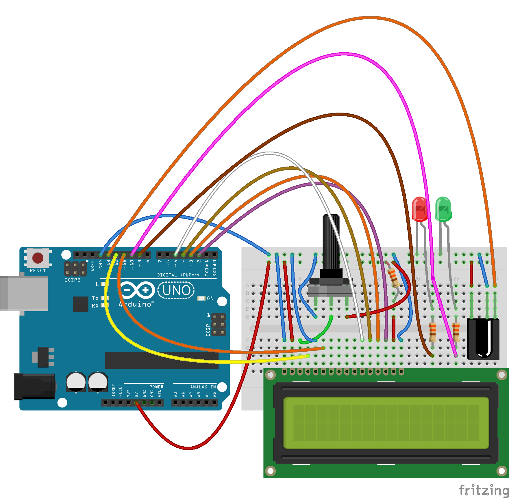

[← zpět na zápisky z Arduino projektů](../index.md)

# Zkoušení matematiky pomocí infra
Program, který zkouší děti ze sčítání a odčítání v předem zvoleném rozsahu. Příklady se generují náhodně, program dokonce počítá body. Při dobrém výsledku rozsvítí zelenou LED, při chybě červenou (a odečte bod). Je možné mít i záporné body. Výstup přes LCD, vstupem je infračervený dálkový ovladač. 

Tento projekt vám nebude fungovat ihned po zapojení a nahrátí programu. Je potřeba si jej upravit na svůj vlastní dálkový infra ovladač. My jsme vzali ten, který si nejlépe rozuměl s naším přijímačem, sepsali jsme si kódy, kterými jsme chtěli hru ovládat. Budete muset postupovat stejně, nepředpokládám, že byste doma našli náš dálkový ovladač od 20 let staré mikrověže Aiwa :-)

## Co je potřeba umět
Tento projekt je z velké části postaven na pokusech s [LCD](../lcd/lcd.md) a [infra](TODO), tedy je dobré mít nějaké zkušenosti s displejem i s příjmem infra signálu. Z pohledu programování jde taktéž trochu o pokročilejší úlohu, ale dospělá může obtížná místa pomoci dítěti překonat.

## Foto










## Hardware
* LCD, my jsme použili Qapass 1602A, 16 znaků × 2 řádky ([Aliexpress](https://www.aliexpress.com/wholesale?catId=0&initiative_id=SB_20170325123003&SearchText=1602a), [specifikace](../lcd/eone-1602a1.pdf))
* infračervený sensor, my jsme použili AX-1838HS ([Aliexpress](https://www.aliexpress.com/wholesale?catId=0&initiative_id=SB_20170326120050&SearchText=HX1838+), [specifikace](IR-Receiver-AX-1838HS.pdf))
* 10&nbsp;kΩ potenciometr
* 3× 330&nbsp;Ω rezistor
* červená a zelená LED
* jako vysílač signálu jsme využili dálkový ovladač k mikrověži Aiwa, ale lze využít prakticky cokoliv

## Schéma zapojení pro detekci kódů ovladače
[aiwa_infra.fzz](aiwa_infra.fzz)

[](aiwa_infra_bb.png)

## Program pro detekci kódů ovladač
Program slouží k detekci jednotlivých kódů. Je založen na demo programu [IRrecvDump.ino](https://github.com/z3t0/Arduino-IRremote/blob/master/examples/IRrecvDump/IRrecvDump.ino), který vypisuje hodnoty, které detekuje na infrasenzoru. Tímto způsobem je možné zjistit, jaké kódy vysílá váš ovladač, zapsat si je a dále je využít pro ovládání vašich projektů. V případě dálkových ovladačů k zařízením jako je televize nebo rádio je dobré vybírat tlačítka, která je nespustí, aby pak šlo ovládat Arduino v jejich přítomnosti a nezapínat u toho televizi.
[aiwa_infra.ino](aiwa_infra.ino)
``` c++

```

## Schéma zapojení infra matematiky
[infra_matika.fzz](infra_matika.fzz)

[](infra_matika_bb.png)

## Program infra matematiky
[infra_matika.ino](infra_matika.ino)
``` c++

```
## Možná vylepšení
* Další typy příkladů, např. násobení a dělení.

## Poznatky
Velmi oblíběný projekt, který rozvíjel dále nápady, co by se dalo ještě vylepšit. Od samého počátku to byla dobrodružná akce, když jsme vybírali infra ovladač, kterým budeme hru ovládat, následně zapisovali kódy. Na přání dětí jsme přidali červenou a zelenou LED a mnoho vylepšení do kódu (např. ošetření maximálního počtu na otázku do kolika se budou příklady generovat). Výsledek sloužil opravdu k procvičování matematiky a to po dlouhé týdny, kdy to děti odmítaly rozebrat.
