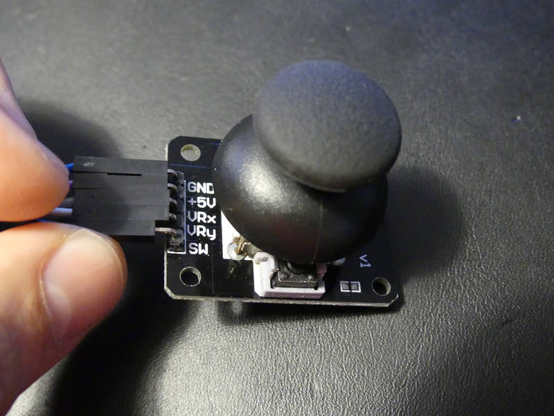
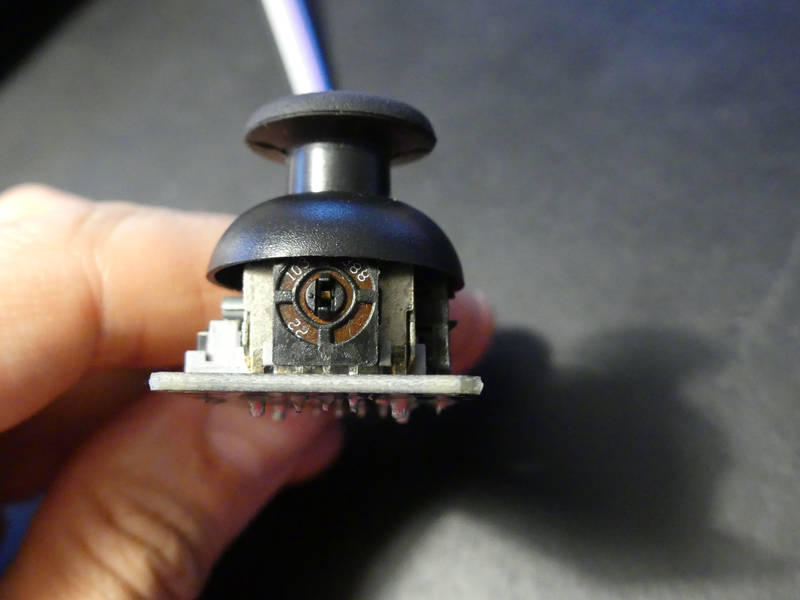
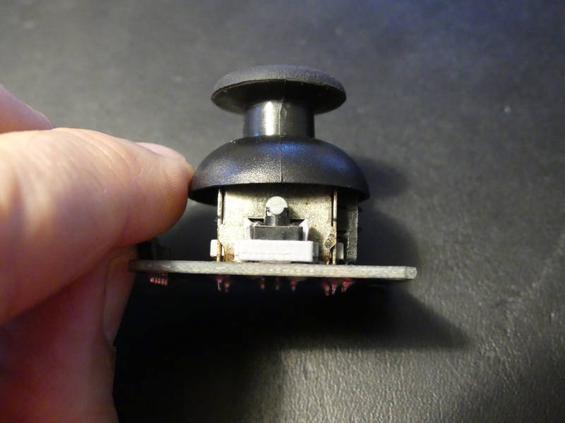
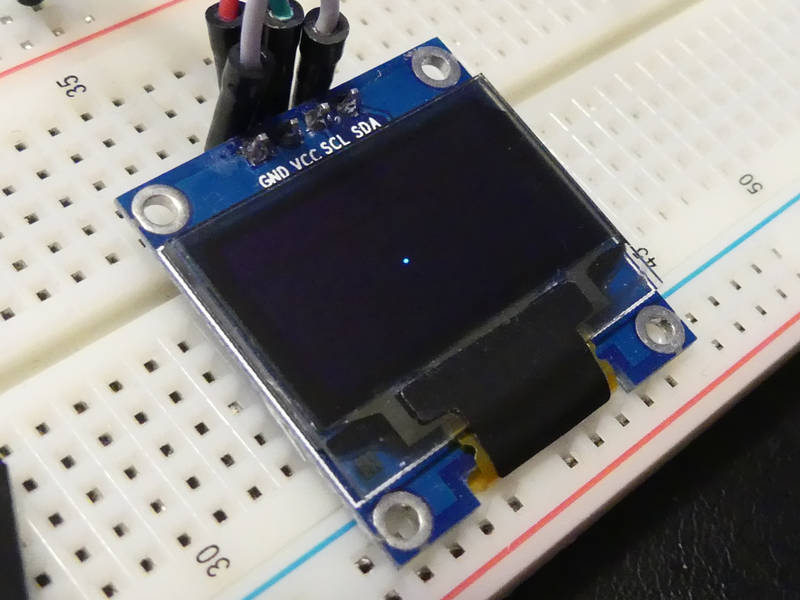
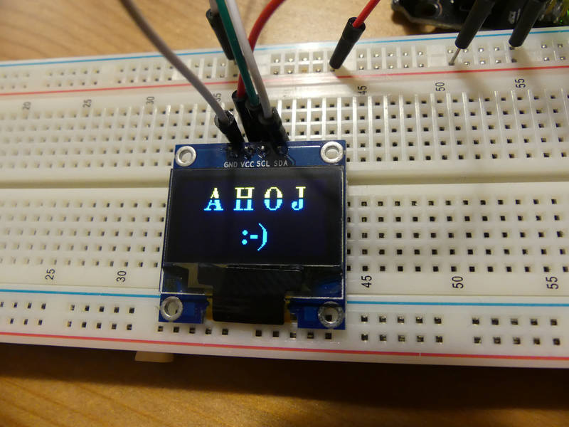
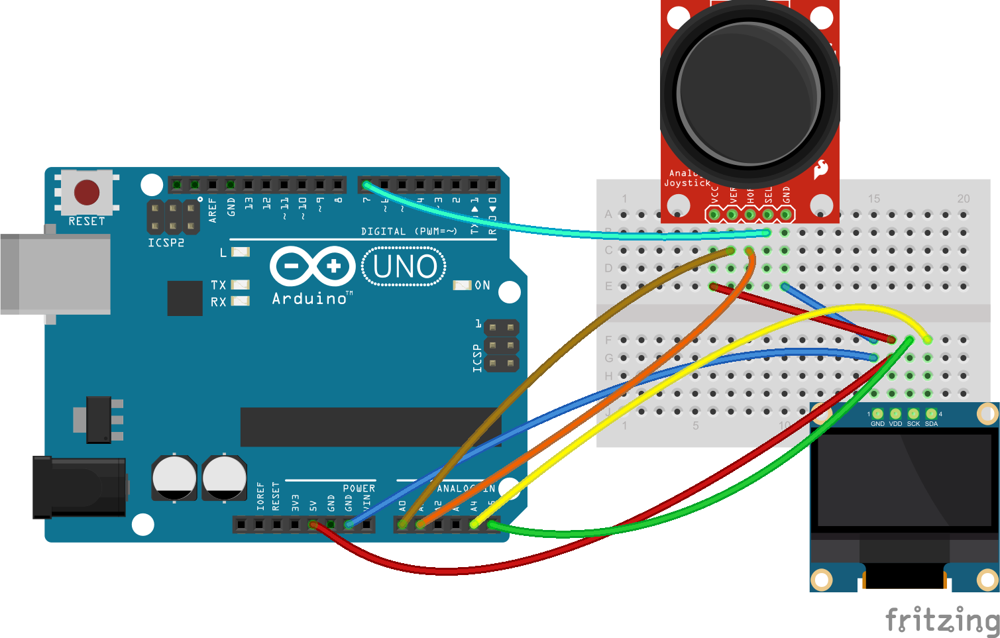

[← zpět na zápisky z Arduino projektů](../index.md)

# Joystick
Testování analogového joystickového ovladače, který umožňuje pohyb do všech směrů včetně stisku tlačítka. Zkusili jsme naprogramovat ovládání jednopixelového puntíku, analogový signál z joysticku převádíme na 2 rychlosti (pomalu a rychle) a na stisk tlačítka se zobrazí pozdrav. Jenom jednoduché cvičení, které se může hodit pro další úlohy.

## Co je potřeba umět
Ovládání [OLED](../oled/oled.md) displeje.

## Foto






## Video

<div markdown="0">
    <video controls>
        <source src="joystick.mp4" type="video/mp4">
        Bohužel, váš prohlížeč neumí HTML5 video. <a href="joystick.mp4">Přehrajte si jej jako soubor.</a>
    </video>
</div>

## Hardware
* OLED displej, my použili SSD1306 ([Aliexpress](https://www.aliexpress.com/wholesale?catId=0&initiative_id=SB_20170322115850&SearchText=OLED+0.96))
* joystick ([Aliexpress](https://www.aliexpress.com/wholesale?ltype=wholesale&d=y&origin=y&isViewCP=y&catId=0&initiative_id=SB_20170429111439&SearchText=arduino+joystick&blanktest=0&tc=af))

## Jak to funguje
Joystick dává na pinech `vx` a `vy` analogový signál, takže připojujeme na analogové piny Arduina. `A4` a `A5` máme rezervované pro I2C z OLED, tak si vybereme jiné 2. Pin `switch` pak dává digitální hodnotu, zda je tlačítko stisknuto.

## Schéma zapojení
[joystick.fzz](joystick.fzz)

[](joystick_bb.png)

## Program
[joystick.ino](joystick.ino)
```c++

```
## Možná vylepšení
* Plynulejší přenášení rychlosti joysticku: je možné se seznámit s mapovací funkcí [map()](https://www.arduino.cc/en/reference/map), která umí automaticky přepočítávat hodnoty mezi rozsahy (např. hodnotu z rozsahu analogového pinu 0 až 1023 na rozsah -10 až 10, tedy počet pixelů, o který se bude puňta posouvat).

## Poznatky
* Opět překvápko, myslel jsem si, že to bude celkem nezáživná věc prohánět po pidispleji 1 pixel, ale děti to bavilo hodně. Radost z prvního posunutí (byť s chybami) byla ohromná.
* Zatím nevím, proč se v sekci `setup()` musí do digitálního pinu tlačítka zapsat `HIGH` (a následně detekujeme stisk tlačítka na tomto pinu jako `LOW`). Ale bez tohoto fíglu nám to nejelo.
* K tomu, abychom mohli např. po stisku tlačítka malovat, by bylo potřeba si pamatovat vše, co jsme kam namalovali (videopaměť), displej sám si nic nepamatuje a je potřeba ho neustále obnovovat, tedy v každou chvíli je nutné vědět, co se má vykreslit. Displej má rozlišení 128×64, což je celkem 8192 pixelů, není tedy možné si jen tak vyseknout dvourozměrné pole v SRAM paměti Arduina, protože [ta má pouhé 2KiB](https://www.arduino.cc/en/tutorial/memory), je potřeba informace uchovávat po bitech, ale i pak nám bude zabírat naše malá videopaměť celou polovinu SRAM (8192 / 8 = 1024). Vyzkoušíme někdy příště.
