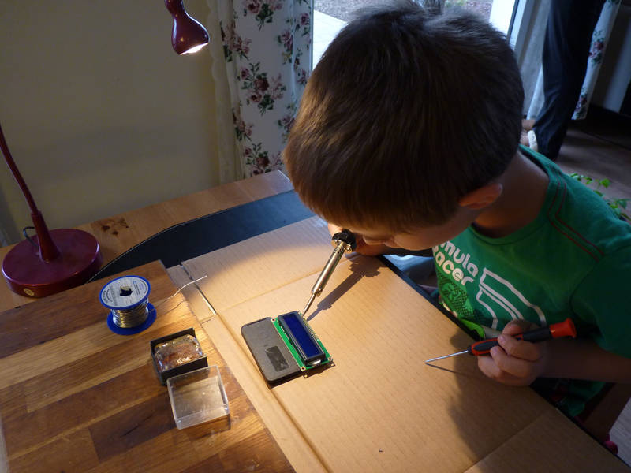
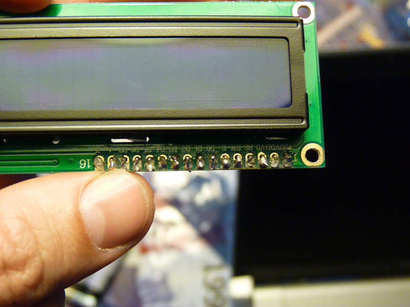
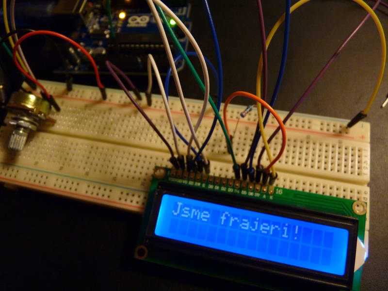

[← zpět na zápisky z Arduino projektů](../index.md)

# LCD displej
Já vím, já vím, je to stejné, jako psát CD disk, přičemž zkratka CD už sama o sobě obsahuje slovo disk (Compact disc), tak i LCD znamená Liquid crystal display, tedy displej s tekutými krystaly. Nicméně mezi neodbornou veřejností je to zkratka označující typ displeje.

Tato úloha slouží pouze k osahání displeje jako takového. K řádnému připojení, vyzkoušení, že vše funguje a až ho budeme někde potřebovat, tak už to budeme umět. 

## Co je potřeba umět
Displej je obvykle s "dírkami" místo pinů. Ty jsou dobré k pájení obvodů, ale už podstatně méně se hodí k prototypování, tedy rozebiratelnému spojování obvodů na zkoušku. Je tedy dobré ho nejdříve opatřit "hřebenem". Na tom může dítě nacvičit pájení. Spoje se samozřejmě nesmí nikde dotýkat.

## Foto




## Hardware
* LCD, my jsme použili 16×2 (16 znaků × 2 řádky) TODO
* 10&nbsp;kΩ potenciometr
* 330&nbsp;Ω rezistor

## Jak to funguje
Zapojení vychází z příkladu TODO a využívá programově knihovnu [LiquidCrystal](https://www.arduino.cc/en/Reference/LiquidCrystal). Potenciometr slouží k regulaci intenzity podsvětlení displeje.

## Schéma zapojení
[lcd.fzz](lcd.fzz)


## Program
[lcd.ino](lcd.ino)
``` c++

```
## Možná vylepšení
* Libovolný jiný text :-)
* Vyzkoušení dalších možností knihovny [LiquidCrystal](https://www.arduino.cc/en/Reference/LiquidCrystal), jako pozicování kurzoru, speciální znaky apod.

## Poznatky
Pájení není vůbec lehký úkol, ale trénuje to motoriku a rozhodně patří pro děti k těm zajímavým :-) Radost z vlastních textů na displeji je samozřejmě také nefalšovaná.