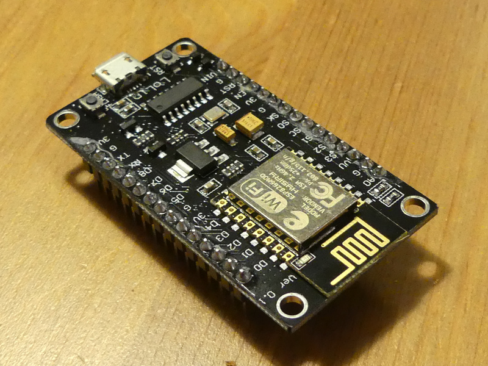
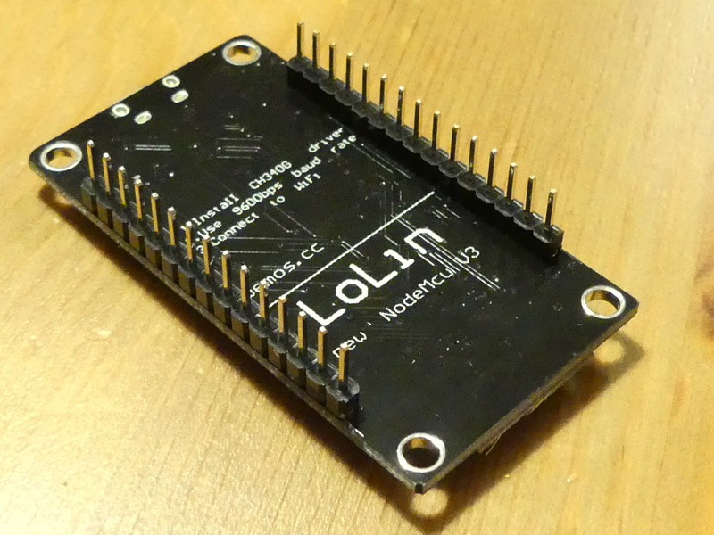
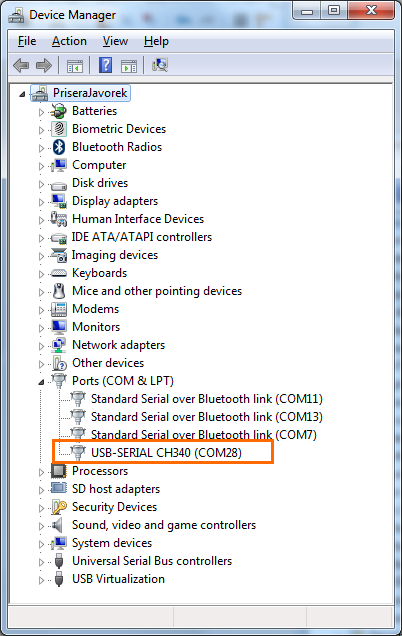
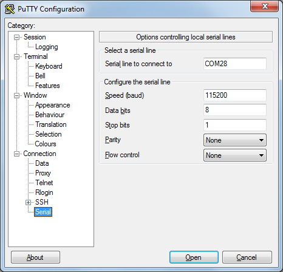
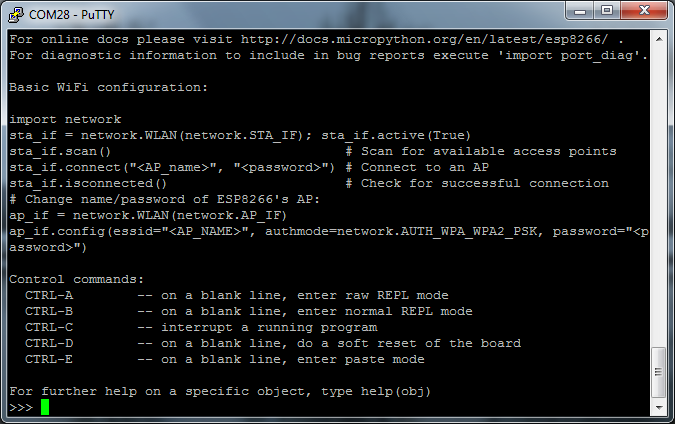
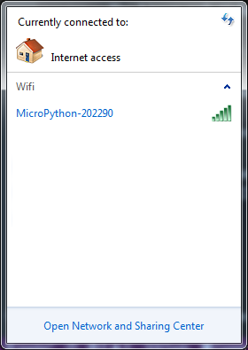
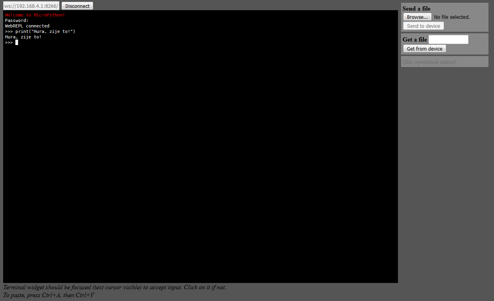

[← zpět na zápisky z Arduino projektů](../../index.md)

[← zpět na Maplebot](../maplebot.md)

# Flash firmware Micropythonu do NodeMCU (ESP8266)
_Tuto sekci jsem prováděl bez dětí. Flashování firmware není zrovna záživná záležitost. Nicméně jednou se k ní děti třeba vrátí, až si budou chtít přeflashovat svoje NodeMCU :-)_

Pořídil jsem několik [NodeMCU devkitů](https://github.com/nodemcu/nodemcu-devkit-v1.0) šlapajících na ESP8266. Tyto čipy díky svému výkonu (v základu 80 MHz, [lze zvýšit až na 160 MHz](http://www.instructables.com/id/ESP8266-NodeMCU-CPU-Speed-Test/) - což i výkon zvýší asi dvojnásobně) zvládají nejen Wifi, ale i interpretované jazyky. Obvykle se nabízí ke koupi s předchystaným interpretem jazyka [Lua](https://www.lua.org/) (vlastně spíš [eLua](http://www.eluaproject.net/)), ale je možné jej vyměnit i za [Micropython](https://micropython.org/) nebo Arduino (programujeme pak v jazyce Wiring, který je velmi podobný C/C++).




Zvolil jsem nakonec Micropython. Nechtělo se mi učit jazyk Lua a C++ je zase trochu nemotorné pro výuku dětí. Má to své [výkonové dopady](http://esp8266freq.blogspot.cz/2016/12/esp-speed-compare-in-lua-micropython.html) (Lua je zhruba 20× pomalejší než C++, Micropython asi 10×), ale jsem s tím srozuměn a jdeme to zkusit. Vždy můžeme flashovat něco jiného.

> Tohle je návod, jak nahrát nový firmware právě do NodeMCU. Vlastní flash firmware jsem prováděl na Windows i Linux, návod popisuje obě platformy.

## Co je potřeba umět
* Trochu se orientovat v příkazové řádce

## Hardware
* NodeMCU devkit (ESP8266), použil jsem od výrobce Lolin ([Aliexpress](https://www.aliexpress.com/wholesale?catId=0&initiative_id=SB_20170926132515&SearchText=nodemcu))
* microUSB kabel

## Software
Aneb někdy taky toolchain. SW nářadí, které bude potřeba.
* [Driver NodeMCU](https://github.com/nodemcu/nodemcu-devkit/tree/master/Drivers)
* [Python](https://www.python.org/downloads/) (na Linuxu nejspíš už máte)
* [Esptool](https://github.com/espressif/esptool)
* [Micropython firmware](http://micropython.org/download#esp8266)

## Postup
### 1. Stáhnout  a nainstalovat [NodeMCU driver](https://github.com/nodemcu/nodemcu-devkit/tree/master/Drivers), aby ho rozpoznal operační systém
### 2. Připojit NodeMCU k počítači přes microUSB kabel
### 3. Zjistit, na jakém portu se objevil
**Windows** (nemám bohužel českou verzi)
* Control panels/Device manager
* Pod záložkou Ports (COM & LPT) najít, kde ho máme



**Linux**
``` shell
ls -l /dev/tty*
```

### 4. Nainstalovat [Python](https://www.python.org/downloads/)
Brát verzi 3.x, na Linuxu velmi pravděpodobně už Python je. 

### 5.  Získat Esptool
Nástroj napsaný v pythonu pro flashování ESP8266 z příkazové řádky. Lze ho stáhnout přímo z [Githubu](https://github.com/espressif/esptool) a nebo je možné ho samozřejmě nainstalovat přímo přes pip:
``` shell
pip install esptool
```

### 6. Zjistit typ čipu
Pokud jsme zvědaví, můžeme zjistit typ čipu.
``` shell
python esptool.py --port <port> flash_id
```
Kde `<port>` je náš port, kde se NodeMCU zrovna nachází. Pro Windows tedy nějak takto:
``` shell
python esptool.py --port COM28 flash_id
```
Pro Linux pak třeba takto:
``` shell
python esptool.py --port /dev/ttyUSB0 flash_id
```
A dostaneme nějakou podobnou odpověď 
``` shell
esptool.py v2.2-dev
Connecting....
Detecting chip type... ESP8266
Chip is ESP8266EX
Uploading stub...
Running stub...
Stub running...
Manufacturer: c8
Device: 4016
Detected flash size: 4MB
Hard resetting...
```

### 7. Zjistit mac adresu
Můžeme si nechat prozradit i MAC adresu zařízení.
``` shell
python esptool.py --port <port> read_mac
```
``` shell
esptool.py v2.2-dev
Connecting....
Detecting chip type... ESP8266
Chip is ESP8266EX
Uploading stub...
Running stub...
Stub running...
MAC: 70:01:88:20:22:21
Hard resetting...
```

### 8. Stáhnout [Micropython firmware](http://micropython.org/download#esp8266) pro ESP8266
Stahujeme bin soubor.

* Pokud bychom chtěli flashnout (zpátky) [inpterpret Lua](https://github.com/nodemcu/nodemcu-firmware), je nutné si soubor sestavit ve vlastní režii ze zdrojáků a nebo si ho nechat sestavit on demand službou [NodeMCU custom builds](https://nodemcu-build.com/) - a vybrat si jen moduly, které potřebujeme.
* Můžeme také [NodeMCU programovat jako Arduino](https://github.com/esp8266/Arduino/) v jazyce Wiring (pak je možné ho programovat i v Arduino IDE). Board manager v Arduino IDE se pak postará o to, že sestaví pokaždé celý firmware ESP8266 SDK spolu s naším programem a flashuje vše do NodeMCU. To znamená, že jednoduchý program na bliknutí LED pak může mít i 250 KiB.

### 9. Přepnout NodeMCU do flash režimu
Některé návody uvádí, že je potřeba vždy uvést čip do flash režimu pomocí tlačítek Flash a Reset. Jiné pak doplňují, že je to hodně hardwarově závislé a pokud má deska USB konektor, USB-serial konvertor a DTR + RTS piny, tak že si to [vše obstará sama bez naší asistence](https://docs.micropython.org/en/latest/esp8266/esp8266/tutorial/intro.html#deploying-the-firmware). 

[NodeMCU se umí samo přepnout do flash režimu](https://nodemcu.readthedocs.io/en/master/en/flash/#putting-device-into-flash-mode). Tento krok tedy uvádím jen pro úplnost. Netřeba nic dělat.

### 10. Smazat obsah flash
Některé návody se o tom nezmiňují, jiné [píší o tom](https://docs.micropython.org/en/latest/esp8266/esp8266/tutorial/intro.html#deploying-the-firmware), že mnoho potíží je zapřičiněno tím, že předchozí firmware není řádně vymazán. Proto doporučuji nejdříve flash smazat. 
``` shell
python esptool.py --port <port> erase_flash
```
``` shell
esptool.py v2.2-dev
Connecting....
Detecting chip type... ESP8266
Chip is ESP8266EX
Uploading stub...
Running stub...
Stub running...
Erasing flash (this may take a while)...
Chip erase completed successfully in 5.3s
Hard resetting...
```

### 11. Zapsat nový firmware do NodeMCU
``` shell
python esptool.py --baud 115200 --port <port> write_flash --flash_mode dio 0x00000 <micropython_esp_firmware>.bin
```
kde 
* `baud` = rychlost zápisu (počet bitů za sekundu), raději neměnit, nekterá zařízení to nemají ráda
* `port` = náš port, kde je NodeMCU
* `write_flash` = příkaz pro zápis firmware do flash
* `flash_mode` = pro NodeMCU **nutně `dio`**, na několika místech jsem se dočetl, že většina desek přežije parametr `qio`, pak že dochází k automatické detekci pro flash > 4 MB, ale stálo mě to více než 2h, než jsem přišel na to, že pro NodeMCU v3 je nutné tento parametr uvést
* 0x00000 = adresa, od které se začíná flashovat - pokud se sestavuje firmware ze zdrojáků, [jsou to obvykle 2 soubory a každý jde od jiné adresy](https://nodemcu.readthedocs.io/en/master/en/flash/#which-files-to-flash)
* `micropython_esp_firmware` = firmware, který tlačíme do NodeMCU

Případné další parametry lze nastudovat v [dokumentaci esptool](https://github.com/espressif/esptool).

> Celá operace chvíli trvá (zhruba do minuty).

``` shell
esptool.py v2.2-dev
Connecting....
Detecting chip type... ESP8266
Chip is ESP8266EX
Uploading stub...
Running stub...
Stub running...
Configuring flash size...
Auto-detected Flash size: 4MB
Flash params set to 0x0240
Compressed 601136 bytes to 392067...
Wrote 601136 bytes (392067 compressed) at 0x00000000 in 34.6 seconds (effective 138.8 kbit/s)...
Hash of data verified.
Leaving...
Hard resetting...
```

### 12. Test Micropython firmware pomocí konzole REPL
Je dobré udělat test. Prvních několik flashů se mi nepovedlo (nenastavil jsem `--flash-mode`) a nikdo neprotestoval (ani NodeMCU, ani esptool). REPL je zkratka pro Read Evaluate Print Loop, v zásadě to pro nás znamená vzdálenou konzoli. Pokusíme se dostat do Micropython interpretu nahraného v NodeMCU.

Do REPL NodeMCU se dá přes USB kabel přihlásit libovolným sériovým terminálem. 
**Windows**
Oblíbený terminál [putty]() s parametry:
* typ připojení: serial
* port: náš port, přes který je NodeMCU připojen na USB
* rychlost 115200
* data bits 8, stop bits 1, no parity, no flow



Po připojení je někdy potřeba stisknout tlačítko `Reset` na NodeMCU. Prvních zmatených znaků si nevšímáme a do konzole píšeme:
```python
>>> print("Hura, zije to!")
```


Další informace bychom získali třeba
```python
>>> help()
```



**Linux**
Lze použít např. terminál [screen](https://www.gnu.org/software/screen/manual/screen.html) či třeba [picocom](http://manpages.ubuntu.com/manpages/zesty/man8/picocom.8.html).
```shell
screen /dev/ttyUSB0 115200
```
```shell
picocom -b 115200 /dev/ttyUSB0
```


### 13. Test Micropython firmware pomocí konzole WebREPL
Přihlásit se do Micropython konzole lze samozřejmě i vzduchem. Micropython nastartuje automaticky Wifi AP, pokud si nepřejeme něco jiného.



Pokud se přihlásíme do jeho sítě, můžeme se tak dostat pomocí WebREPL do konzole Micropythonu. WebREPL je speciální Javascript app, kterou si můžeme [stáhnout lokálně](https://github.com/micropython/webrepl), ale která běží i [hostovaná online](http://micropython.org/webrepl/).

Nejdříve je však potřeba WebREPL povolit, jelikož výchozí nastavení je vypnuto.

1. NodeMCU připojit přes USB kabel.
1. Přihlásit se seriovým terminálem do REPL (viz bod 12)
1. Z konzole spustit: 
```python
import webrepl_setup
```
4. Povolíme WebREPL a nastavíme heslo do WebREPL konzole.
1. Odpojit NodeMCU od počítače. Vyhledat jiný zdroj napájení pro NodeMCU, třeba USB adaptér.
1. Přihlásíme se do wifi sítě NodeMCU - [heslo do Micropython wifi je](http://docs.micropython.org/en/latest/esp8266/esp8266/tutorial/intro.html#wifi) `micropythoN` (pozor, připojením ztratíme internet).
1. Jdeme do WebREPL konzole, IP adresa našeho malého AP je `192.168.4.1`. Connect.
1. Zadat naše heslo a jsme tam.



Jak se dostat do WebREPL z domácí wifi sítě bez nutnosti se připojovat na AP NodeMCU je pěkné popsáno [tady](https://learn.adafruit.com/micropython-basics-esp8266-webrepl/access-webrepl).

