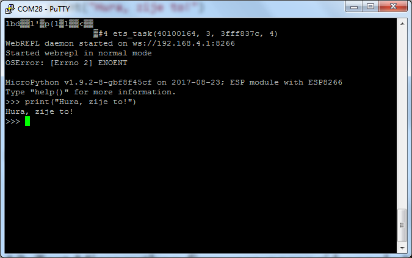

[← zpět na zápisky z Arduino projektů](../../index.md)

[← zpět na Maplebot](../maplebot.md)

# Jak rozchodit konzoli Micropythonu
* obsah
{:toc}

Poté, co [zdárně nahrajeme Micropython do NodeMCU](../nodemcu_flash_micropython/nodemcu_flash.md), bychom se potřebovali nejlépe nějak přihlásit k NodeMCU do Python konzole. V zásadě existují 3 způsoby: REPL, WebREPL AP, WebREPL klient. REPL je zkratka pro Read Evaluate Print Loop a v zásadě to pro nás znamená tu vzdálenou konzoli. 

<a name="repl"></a>
## REPL
Do REPL NodeMCU se dostaneme přes USB kabel libovolným sériovým terminálem. 

**Windows**
Oblíbený terminál [putty](http://www.putty.org/) s parametry:
* typ připojení: serial
* port: náš port, přes který je NodeMCU připojen na USB
* rychlost 115200
* data bits 8, stop bits 1, no parity, no flow


Po připojení je někdy potřeba stisknout tlačítko `Reset` na NodeMCU. Prvních zmatených znaků si nevšímáme a do konzole píšeme:
```python
>>> print("Hura, zije to!")
```


Další informace bychom získali třeba
```python
>>> help()
```


**Linux**
* Lze použít např. terminál [screen](https://www.gnu.org/software/screen/manual/screen.html) či třeba [picocom](http://manpages.ubuntu.com/manpages/zesty/man8/picocom.8.html).
```shell
screen /dev/ttyUSB0 115200
```
```shell
picocom -b 115200 /dev/ttyUSB0
```


## WebREPL AP
Přihlásit se do Micropython konzole lze samozřejmě i vzduchem. Micropython nastartuje automaticky svoje Wifi AP, pokud si nepřejeme něco jiného. Připojení do takového AP je praktické např. v případech, kdy není na blízku router, jsme v neznámém prostředí (na robosoutěži, na přednášce, na konferenci) a chceme se připojit do WebREPL konzole.


Pokud se přihlásíme do sítě NodeMCU, můžeme se tak dostat pomocí WebREPL do konzole Micropythonu. WebREPL je speciální Javascript app, kterou si můžeme [stáhnout lokálně](https://github.com/micropython/webrepl), ale která běží i [hostovaná online](http://micropython.org/webrepl/).

Nejdříve je však potřeba WebREPL povolit, jelikož výchozí nastavení je vypnuto.

1. NodeMCU připojit přes USB kabel.
1. Přihlásit se seriovým terminálem do [REPL](#repl)
1. Z konzole spustit: 
```python
import webrepl_setup
```
4. Povolíme WebREPL a nastavíme heslo do WebREPL konzole.
1. Odpojit NodeMCU od počítače. Vyhledat jiný zdroj napájení pro NodeMCU, třeba USB adaptér nebo baterie.
1. Přihlásíme se do wifi sítě NodeMCU - [heslo do Micropython wifi je](http://docs.micropython.org/en/latest/esp8266/esp8266/tutorial/intro.html#wifi) `micropythoN` (pozor, připojením ztratíme internet - budeme v síti NodeMCU).
1. Jdeme do WebREPL konzole, IP adresa našeho malého NodeMCU AP je `192.168.4.1`. Connect.
1. Zadat naše heslo a jsme tam.


## WebREPL klient
Mnohem praktičtější a asi běžnější je pro vývoj připojení NodeMCU do lokální Wifi sítě k našemu routeru. Chová se pak jako standardní WiFi klient a my můžeme přistupovat současně na NodeMCU i na internet.

1. Připojit se do NodeMCU (přes [REPL](#repl), ne přes WebREPL, protože nastavení způsobí změnu WiFi).
1. Přímo v REPL konzoli nakonfigurujeme Micropython tak, aby se připojil automaticky k naší WiFi:
``` python
import network
wlan = network.WLAN(network.STA_IF)
wlan.active(True)
wlan.connect('ssid', 'password') # dopln si sve SSID a heslo
```
3. Po chvíli se NodeMCU připojí k WiFi. Výsledek můžeme zkontrolovat pomocí:
``` python
wlan.ifconfig()
```
4. Můžeme vidět, že běží 2 rozhraní:
``` python
import webrepl
webrepl.start()
```
//TODO: obrázek

5. Otevřeme WebREPL a připojíme se na IP adresu, kterou NodeMCU dostalo v naší síti.

//TODO: obrázek

## Vypnutí debug výstupu
NodeMCU si pamatuje vždy poslední WiFi, ke které se připojoval a bude se k ní připojovat vždy po startu. Ne žádnou předchozí, takže při změně na jinou WiFi a zpět na původní je potřeba vždy znovu konfigurovat.

Je proto velmi praktické vypnout debug výstup - pokud přeneseme NodeMCU mimo dosah sítě, bude se pokoušet připojit a bude sypat debug hlášení o tom, že to nejde. Tato hlášení mohou zabránit přístupu k REPL konzoli, protože ta neočekává tenhle debug výstup.
``` python
import esp
esp.osdebug(None)
```
Tyto příkazy bychom ale museli psát pokaždé, co NodeMCU nabootuje, takže je dobré je strčit rovnou do souboru `boot.py`, který se volá pokaždé, když zařízení bootuje (s Micropythonem).

K tomu budeme potřebovat python program [Ampy](https://github.com/adafruit/ampy), který slouží pro přenos souborů tam i zpět. Pozor: přístup přes `ampy` není možné využívat souběžně s REPL konzolí.

1. Instalace Ampy:
``` shell
pip install adafruit-ampy
```
2. stažení aktuálního `boot.py` z NodeMCU:
``` shell
ampy --port <PORT> get boot.py > boot.py
```
3. do souboru `boot.py` přidáme na konec:
``` python
import esp
esp.osdebug(None)
```
4. nahrajeme zpět do NodeMCU:
``` shell
ampy --port <PORT> put boot.py
```

Více příkazů `ampy` je možné získat pomocí:
``` shell
ampy --help
```

Alternativně je možné provést stažení a nahrátí souboru pomocí experimentálního rozhraní pro přenos souborů v konzoli WebREPL.


//TODO: obrázek
