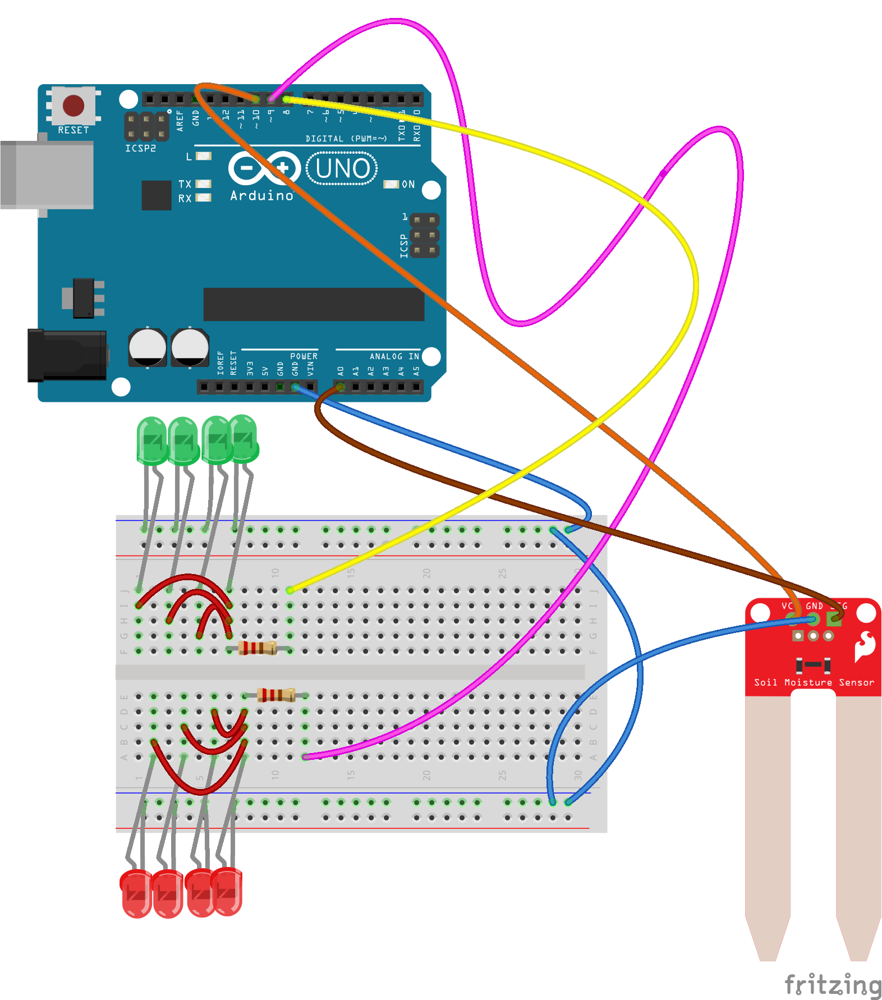

[← zpět na zápisky z Arduino projektů](../index.md)

# Měření hladiny vody ve stojanu na vánoční stromek
* obsah
{:toc}
{::options toc_levels="2..4" /}

Máte-li doma živý vánoční stromek, je dobré, aby měl dostatek vody. Proč je to dobré, to vám vysvětlí tohle pěkné instruktážní video:

<iframe width="854" height="480" src="https://www.youtube.com/embed/26A-49Wb2F4?ecver=1" frameborder="0" gesture="media" allow="encrypted-media" allowfullscreen></iframe>

Rozhodli jsme se tedy postavit čidlo hladiny vody ve stojanu na vánoční stromek. Projekt prováděl syn (9) zcela sám, pouze jsem dohlížel na obtížné části.

## Co je potřeba umět
* Trochu pájet, pokud nestačí délka kabelů

## Foto


Prototyp


Kabely k čidlu bylo potřeba prodloužit


Obestavěno v papírové krabici


Instalace čidla ve stojanu


Napájení Arduina je přes USB


## Hardware
* Několik barevných LED
* 2 rezistory 220&nbsp;Ω
* čidlo půdní vlhkosti, ale je možné ho nahradit i napěťovým děličem, který jsme použili v [hraní si s vodivostí](../touchduino/touchduino.md)

## Jak to funguje
Protože by čidlo vlhkosti mohlo při trvalém napětí rychle reznout, program měří vodu ve stojanu pouze jednou za půl hodiny, po zbytek času je čidlo odpojeno. Ve chvíli, kdy zjistí, že je na suchu, bliká červenými LED a měří zhruba co sekundu. To je dobré, protože je pak okamžitá reakce při zalévání stojanu.

## Schéma zapojení
_(maloval syn (9) sám, celý návhr zapojení je jeho)_

[meric_stromku.fzz](meric_stromku.fzz)

[](meric_stromku_bb.png)

## Program
[meric_stromku.ino](meric_stromku.ino)
``` c++

```

## Možná vylepšení
* Siréna :-)

## Poznatky
* Zjistili jsme, že náš stromek (jedle, asi 2,2&nbsp;m) vypije denně při okolní teplotě kolem 22°C asi 3&nbsp;l vody, což je více než volný objem stojanu. Je proto nutné dolévat i vícekrát za den.