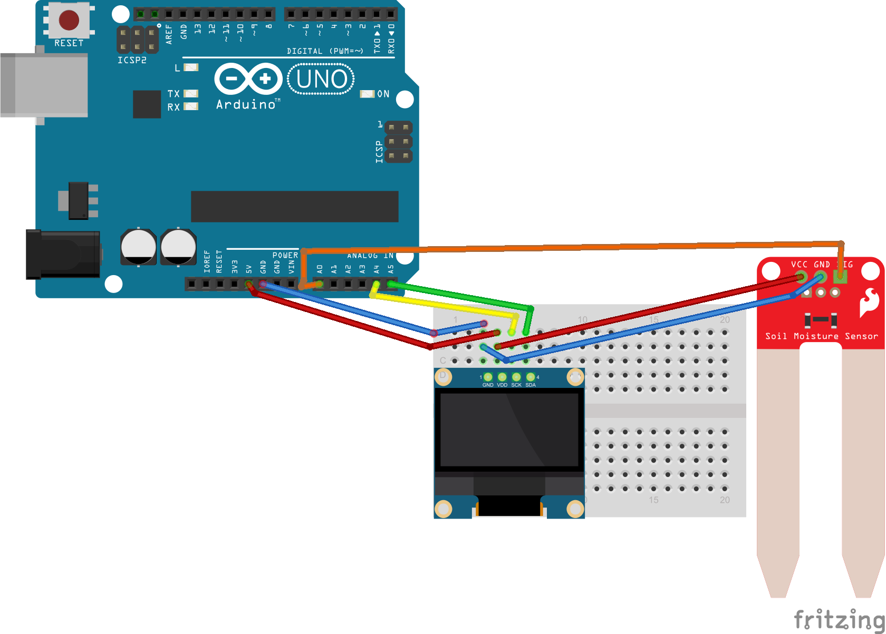

[← zpět na zápisky z Arduino projektů](../index.md)

# Měření půdní vlhkosti
Hrátky s čidlem, které měří odpor. Je tvarem uzpůsobeno pro zastrčení do půdy.

## Co je potřeba umět
* Ovládat OLED displej

## Foto

## Hardware
* OLED displej s&nbsp;I2C, např. SSD1306 ([Aliexpress](https://www.aliexpress.com/wholesale?catId=0&initiative_id=SB_20170322115850&SearchText=OLED+0.96))
* čidlo půdní vlhkosti

## Jak to funguje
### Čidlo vlhkosti
Čidlo je jednoduchý snímač odporu. Hodnoty je však potřeba kalibrovat, tedy např. ho zapíchnout do různých materiálů, zjistit přibližný rozsah hodnot a dle toho dál zpracovávat výstup.
* voda
* hodně vlhká půda
* mírně vlhká půda
* vzduch

Dále je třeba spínat napětí snímače jen ve chvíli, kdy chceme měřit, protože jinak pokud ho udržujeme pod napětím stále, jeho elektrody [velmi rychle zkorodují](http://www.homautomation.org/2014/06/20/measure-soil-moisture-with-arduino-gardening/). Pro dlouhodobější měření je tedy dobré upravit řízení programem Arduina.

### OLED
Pro ovládání displeje mrkněte na [OLED](../oled/oled.md).

## Schéma zapojení
[meric_vlhkosti_pudy.fzz](meric_vlhkosti_pudy.fzz)

## Program

## Možná vylepšení
* Lze vyzkoušet i jako jednoduchý detektor lži :-)
* S měřičem lze např. kontrolovat i výši hladiny v misce Vánočního stromku.

## Poznatky
Zvláště ta část s korozí dětem potrápila hlavu. Jak zabránit tomu, aby to bylo do měsíce zkorodované. A pak kalibrace. Kytky si užily svoje.