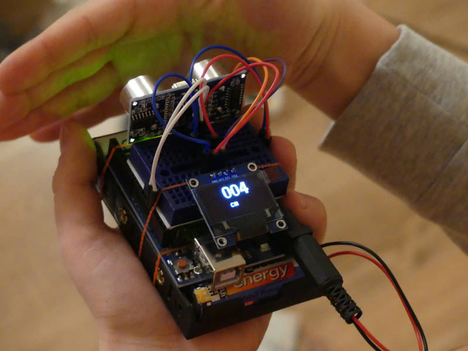
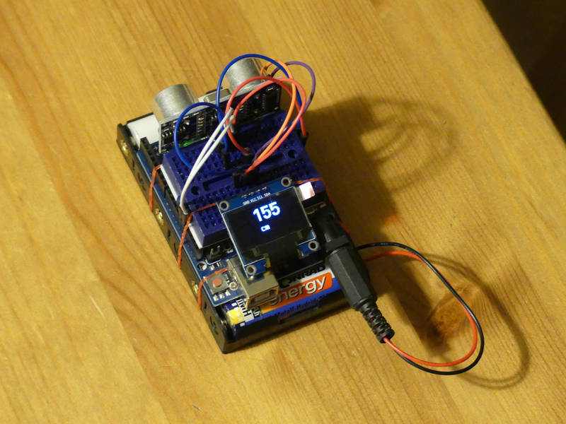
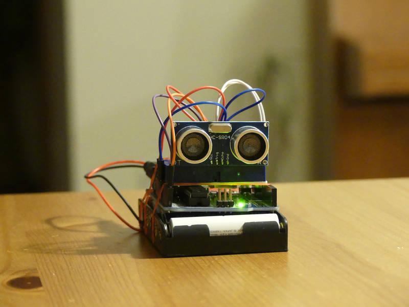
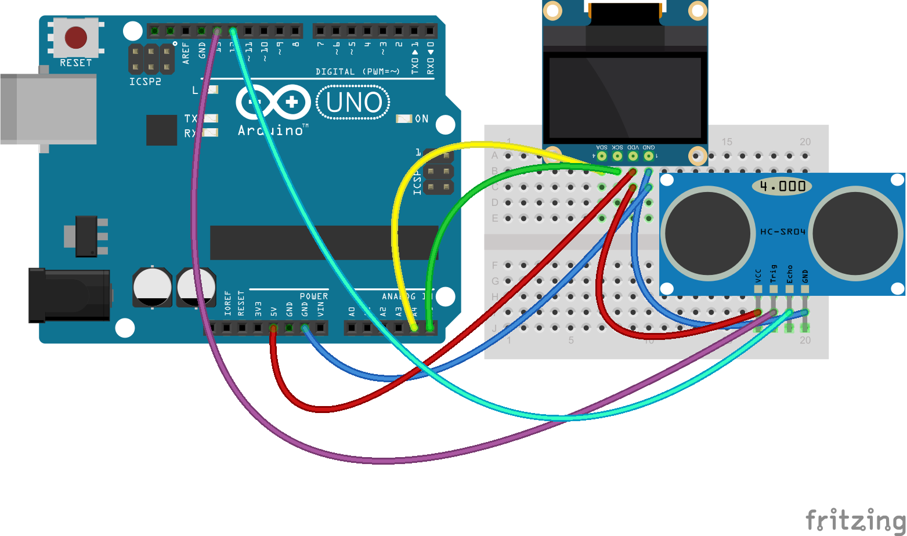

[← zpět na zápisky z Arduino projektů](../index.md)

# Ultrazvukové měření vzdálenosti
Jednoduchý ultrazvukový měřič vzdálenosti se zobrazováním hodnot na OLED displeji.

## Co je potřeba umět
* ovládání [OLED displeje](../oled/oled.md)

## Foto




## Hardware
* OLED displej s&nbsp;I2C, např. SSD1306 ([Aliexpress](https://www.aliexpress.com/wholesale?catId=0&initiative_id=SB_20170322115850&SearchText=OLED+0.96))
* ultrazvukové čidlo HC-SR04 ([Aliexpress](https://www.aliexpress.com/wholesale?catId=0&initiative_id=SB_20170322115709&SearchText=hc-sr04), [specifikace](HCSR04.pdf))

## Jak to funguje
### Měření vzdálenosti ultrazvukem
Sensor HC-SR04 má tyto parametry:
* Napájení: +5&nbsp;V&nbsp;DC
* Klidový proud: < 2&nbsp;mA
* Pracovní proud: 15&nbsp;mA
* Pracovní frekvence: 40&nbsp;kHz
* Měřící rozsah: 2&nbsp;cm – 400&nbsp;cm
* Rozlišení : 0,3&nbsp;cm
* Měřící úhel: 15°

2 piny sensoru jsou napájení (VCC, GND), jeden je vstupní (Trigger) a jeden výstupní (Echo). 

Rychlost zvuku je asi 340&nbsp;m/s = 34&nbsp;000&nbsp;cm/s = 34&nbsp;cm/ms = **0,034&nbsp;cm/µs**  (0,034&nbsp;cm za mikrosekundu). 

Na trigger pin sensoru nastavíme na 10&nbsp;µs 5&nbsp;V, čímž vypustíme 8 ultrazvukových 40&nbsp;kHz vln, následně nám echo pin prozradí, kolik mikrosekund čekal na jejich odraz. Výsledná vzdálenost v cm se následně spočítá
```
s = t * v
s = t * 0,034
```
**Nesmíme ji ale zapomenout vydělit 2**, protože zvuk letěl samozřejmě k překážce a zpět.

### OLED
Pro ovládání displeje mrkněte na [OLED](../oled/oled.md).

## Schéma zapojení
[meric_vzdalenosti.fzz](meric_vzdalenosti.fzz)

[](meric_vzdalenosti_bb.png)

## Program
[meric_vzdalenosti.ino](meric_vzdalenosti.ino)
``` c++

```
## Možná vylepšení
* Při hodnotě vyšší než 4&nbsp;m zobrazit hlášení, že jsme mimo rozsah.
* Při vzdálenosti nad 1&nbsp;m zobrazovat hodnotu v metrech.

## Poznatky
Měření nám fungovalo celkem spolehlivě do jednoho metru, hodně záleží, od čeho se ultrazvuk odráží. Pokud se zapojení udělá rozumně kompaktní, může s ním dítě oběhnout celý dům.

