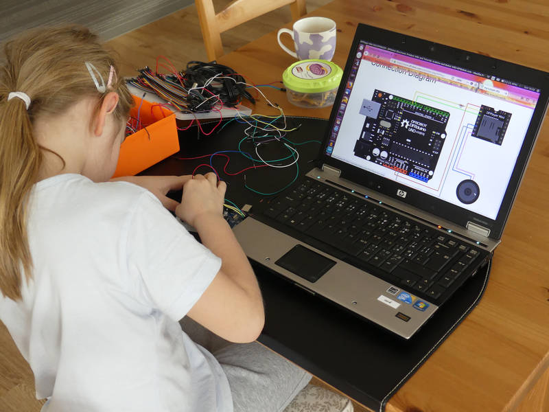

[← zpět na zápisky z Arduino projektů](../index.md)

# Nepřibližuj se!
* obsah
{:toc}
{::options toc_levels="2..4" /}

Po úspěchu [ultrazvukového měření vzdálenosti](../meric_vzdalenosti/meric_vzdalenosti.md) jsme se rozhodli to trochu vylepšit o zvuky :-). Jakmile se k pokladu někdo začne přibližovat, poklad narušitele zvukově odhání.

## Co je potřeba umět
* Projekt zvládne i menší dítě, pokud se smíříme s tím, že nebude rozumět každému slovu v kódu. Nicméně sestavení podmínek pro jednotlivé úrovně vzdáleností už dítě může programovat samo.
* Jde v zásadě o jednoduché propojení [ultrazvukového měření vzdálenosti](../meric_vzdalenosti/meric_vzdalenosti.md) a [demo příkladu na mp3 přehrávač](https://www.dfrobot.com/wiki/index.php/DFPlayer_Mini_SKU:DFR0299).

## Foto




## Video

<div markdown="0">
    <video controls>
        <source src="nedotykej_se.mp4" type="video/mp4">
        Bohužel, váš prohlížeč neumí HTML5 video. <a href="nedotykej_se.mp4">Přehrajte si jej jako soubor.</a>
    </video>
</div>

## Hardware
* ultrazvukové čidlo HC-SR04 ([Aliexpress](https://www.aliexpress.com/wholesale?catId=0&initiative_id=SB_20170322115709&SearchText=hc-sr04), [specifikace](HCSR04.pdf))
* mp3 přehrávač ([Aliexpress](https://www.aliexpress.com/wholesale?catId=0&initiative_id=SB_20180318111806&SearchText=mini+mp3+player+arduino), [specifikace](https://www.dfrobot.com/wiki/index.php/DFPlayer_Mini_SKU:DFR0299))
* malý reproduktor ([Aliexpress](https://www.aliexpress.com/wholesale?catId=0&initiative_id=SB_20180318112256&SearchText=mini+amplifier+speaker+horn))
* microSD karta pro přehrávač

## Software
* něco pro nahrávání zvuku, např. [Audacity](https://www.audacityteam.org/)

## Jak to funguje
Ultrazvukové čidlo měří vzdálenost a podle toho pouští jednotlivé skladby na mp3 přehrávači.

## Schéma zapojení

_(malovala dcera (7) sama)_

[nepriblizuj_se_bb.fzz](nepriblizuj_se_bb.fzz)

[](nepriblizuj_se_bb.png)

## Program
[nepriblizuj_se.ino](nepriblizuj_se.ino)
``` c++

```

## Možná vylepšení
* Zapojení by šlo předělat např. na zvukový sonar, kdy bude lidským hlasem oznamovat vzdálenost od překážky (např. "dva a půl metru")
* Různé druhy sirén, kdy dojde k detekci překážky
* Zobrazování dalších hodnot či vzkazů na [OLED displeji](../meric_vzdalenosti/meric_vzdalenosti.md)

## Poznatky
* Zatím jsme nepřišli na to, jak zjistit z přehrávače, že přehrává skladbu (nebo že ji dopřehrával), tedy dáváme za puštění skladby vždy tvrdé prodlevy `delay()`.
* Pokud jsme detekovali ultrazvukem vzdálenost rychleji 5× za sekundu (pauza menší než 200&nbsp;ms), tak docházelo k významným měřícím chybám, vracela se čísla >&nbsp;3000&nbsp;cm (sonar měří asi do 4&nbsp;m) a současně pak přicházela chybná měření např. <&nbsp;50&nbsp;cm, aniž byla nějaká překážka v dosahu. Nastavení prodlevy na 200&nbsp;ms sice zpomalí reakci sonaru, ale vyřešilo to problém.
