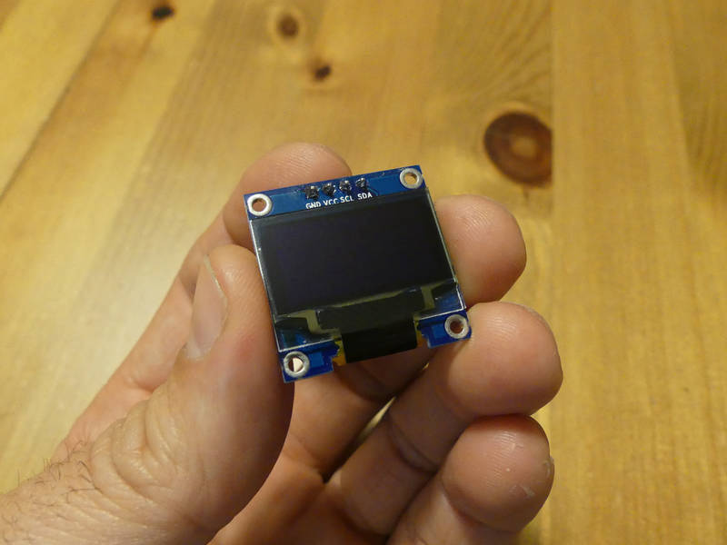
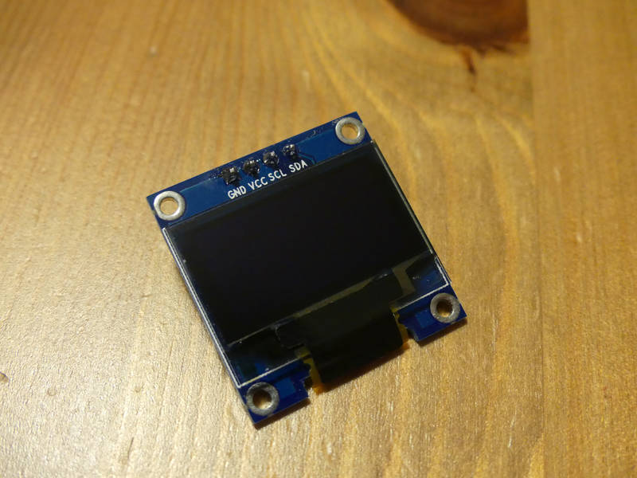
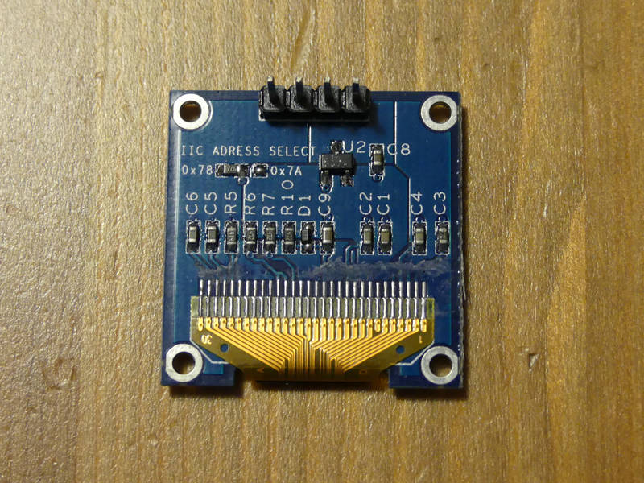
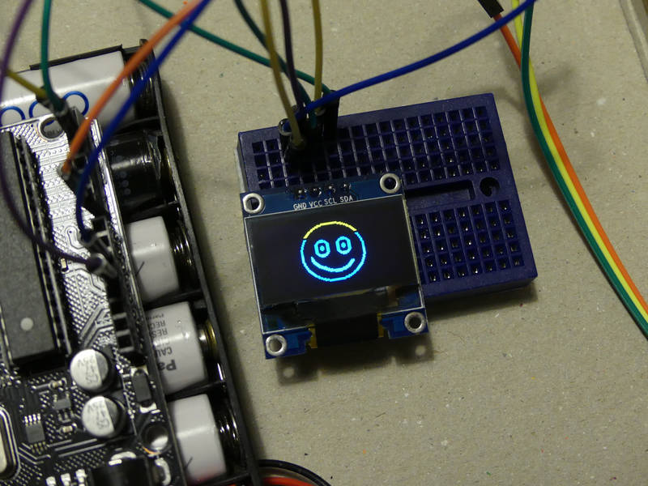
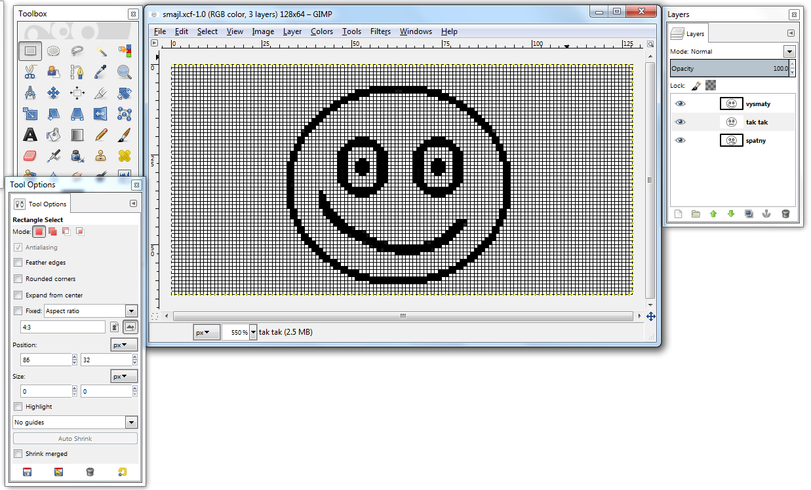
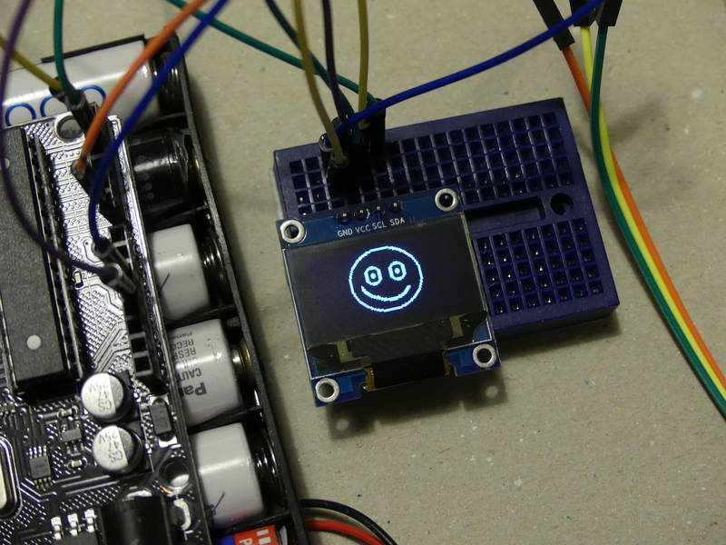
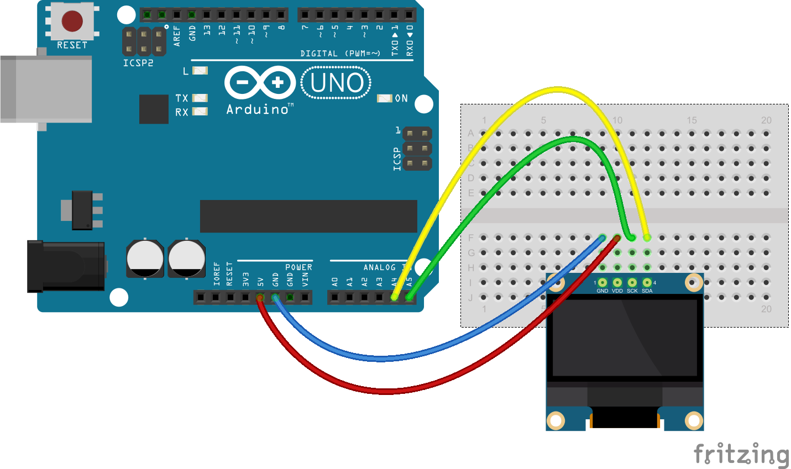

[← zpět na zápisky z Arduino projektů](../index.md)

# OLED
Naše první pokusy s OLED displejem. Já vím, zkratka OLED už sama o sobě v sobě obsahuje slovo displej, ale stejně tomu tak všichni říkají :-) OLED mají nízkou spotřebu a dobrý zobrazovací kontrast (svítí jen to, co svítit musí). Tak jsme taky nějaké chtěli vyzkoušet.

## Co je potřeba umět
Rozhodně se hodí vědět, jaký přesně displej vlastně držím v ruce. To usnadní jeho ovládání :-) Jinak nejsou potřeba asi žádné speciální znalosti.

## Hardware
* OLED displej s&nbsp;I2C, např. SSD1306 ([Aliexpress](https://www.aliexpress.com/wholesale?catId=0&initiative_id=SB_20170322115850&SearchText=OLED+0.96))

## Jak to funguje
OLED displej, který jsme využili, má úhlopříčku 0,96" a rozlišení 128×64 pixelů. Připojili jsme ho přes rozhraní I2C. To komunikuje na 2 pinech `SDA` (data) a `SCL/SCK` (clock). Tyto má Arduino Uno schováno na analogových  pinech `A4 (SDA)` a `A5 (SCL/SCK)`. 



K ovládání displeje se dále hodí knihovna [u8g](https://github.com/olikraus/u8glib/wiki/userreference). Asi nejtěžším úkolem bylo zjistit, co přesně máme za displej a jakým konstruktorem knihovnu inicializovat. Nutno říci, že na displeji samotném jsme příliš vodítek nenašli.




Někdy můžete natrefit na displej, který je dvoubarevný. Nejde většinou o plnohodnotnou dvoubarevnost, ale jistá část displeje se zobrazuje vždy pevně jednou barvou a zbytek druhou. Barvu tak nenastavujete při vykreslování jako parametr, ale volíte ji umístěním na displeji.



Texty se na displeji vypisují metodou [drawStr](https://github.com/olikraus/u8glib/wiki/userreference#drawstr). Fonty se nastavují metodou [setFont](https://github.com/olikraus/u8glib/wiki/userreference#setfont) a je [z čeho vybírat](https://github.com/olikraus/u8glib/wiki/fontsize).

Následně děti projevily velký zájem zobrazovat na displej i něco jiného než jen texty různých velikostí. Postup je následující:
1. Namalovat obrázek ve svém oblíbeném grafickém programu. Je dobré si nastavit velikost papíru na rozlišení displeje (např. 128×64), abychom se pak vešli. Pokud je displej jednobarevný či falešně dvoubarevný, je dobré kreslit pouze černou na bílem podkladu. Výsledný obrázek ořezat na minimální velikost.

1. Pomocí programu pro převod bitmapy do kódu převést obrázek. Převod je vlastně pouhý převod černých pixelů na zápis v šestnáctkové soustavě (hexa) do zdrojového kódu tak, aby bylo možné ho nahrát do displeje.
1. K převodu jsme využili program [Image2Code](https://github.com/ehubin/Adafruit-GFX-Library/tree/master/Img2Code) napsaný v Javě (stačí pouze soubor [Image2Code.jar](https://github.com/ehubin/Adafruit-GFX-Library/blob/master/Img2Code/Image2Code.jar), neinstaluje se, stačí spustit). Pokud Javu na počítači zatím nemáte, je potřeba doinstalovat. Pro Linux třeba takto:
``` bash
sudo apt-get install default-jre
``` 
Program se pak spouští z příkazové řádky
``` bash
java -jar Image2Code.jar
``` 


Ale je samozřejmě možné využít i jakýkoli jiný program, např. [LCD image converter](http://www.riuson.com/lcd-image-converter), který běhá na Windows, ale je možné ho zkompilovat i pro Linux - a celkově vypadá vymazleně.

Výsledný hexa kód nakopírovat do zdrojového souboru pro Arduino. 
``` c++
const uint8_t veselySmajl[] PROGMEM = {
0xff,0xff,0xff,0xff,0xff,0xff,0xff,0xff,0x80,
...
...
...
};
```

Ještě potřebujeme vědět, jaké má obrázek rozměry. Šířku vydělíme osmi a zaokrouhlíme nahoru (= počet bajtů, které jsou na řádku), výšku pak necháme, jak je. Pro vykreslení slouží funkce [drawBitmapP()](https://github.com/olikraus/u8glib/wiki/userreference#drawbitmapp).
``` c++
//sirka obrazku = 65 -> 9 bajtu na radek
// vyska obrazku = 57
drawBitmapP(5, 5, 9, 57, veselySmajl);
```

Knihovna [u8g](https://github.com/olikraus/u8glib/wiki/userreference) využívá koncept redraw - je potřeba neustále obnovovat stav displeje [opakovaným překreslováním](https://github.com/olikraus/u8glib/wiki/tpictureloop).
``` c++
void loop(void) {
  u8g.firstPage();  
  do {
    draw();
  } while( u8g.nextPage() );

  // po nejake dobe prekresli displej
  delay(1000);
}
```



## Schéma zapojení
[oled.fzz](oled.fzz)

[](oled_bb.png)

## Program s textem
[oled_txt.ino](oled_txt.ino)
``` c++

```

## Program s obrázkem
[oled_pic.ino](oled_pic.ino)
``` c++

```

## Možná vylepšení
* Jakékoliv hrátky s displejem. Kombinace s [ručními blikači](../rucni_blikace/rucni_blikace.md), [automatickými blikači](../automaticke_blikace/automaticke_blikace.md), apod.
* Je možné vytvořit jednoduché hry, přeci jen OLED displej dává poněkud sofistikovanější zobrazovací možnosti. Spolu s tlačítky je pak možné vyhodnocovat odpovědi hráče nebo hru přímo ovládat.

## Poznatky
* Nejvíce nás potrápila detekce displeje, pak správný konstruktor, nakonec zapojení na SDA/SCK na Arduinu (nevěděl jsem, že jsou na pinech A4/A5). Ovládání přes knihovnu [u8g](https://github.com/olikraus/u8glib/wiki/userreference) bylo naopak už docela lehké.
* Náš OLED displej je sice maličký, ale je to displej a to dává všem projektům úplně jiný rozměr.
