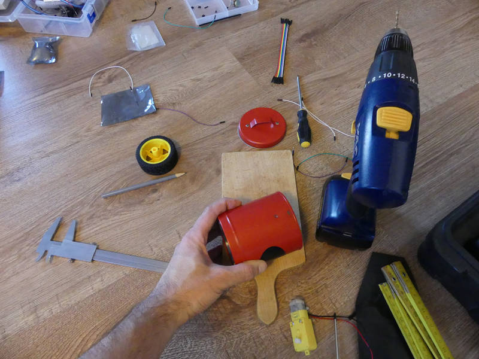
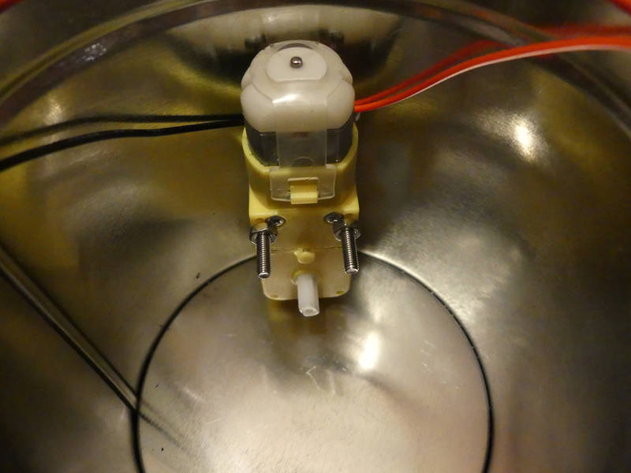
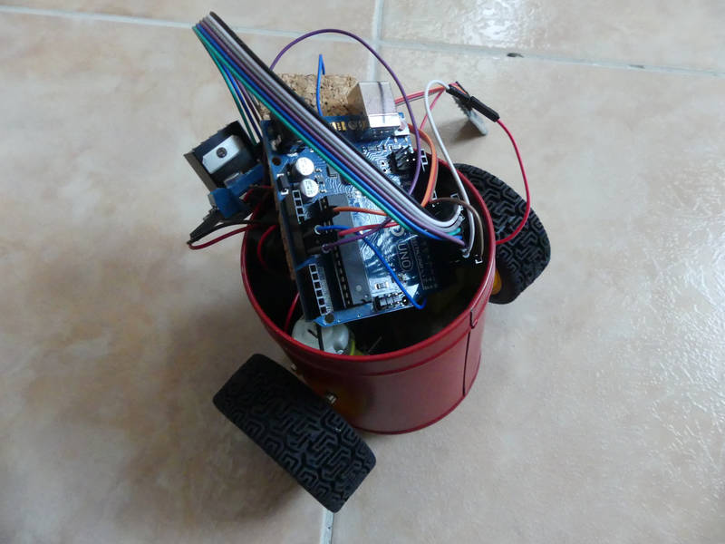
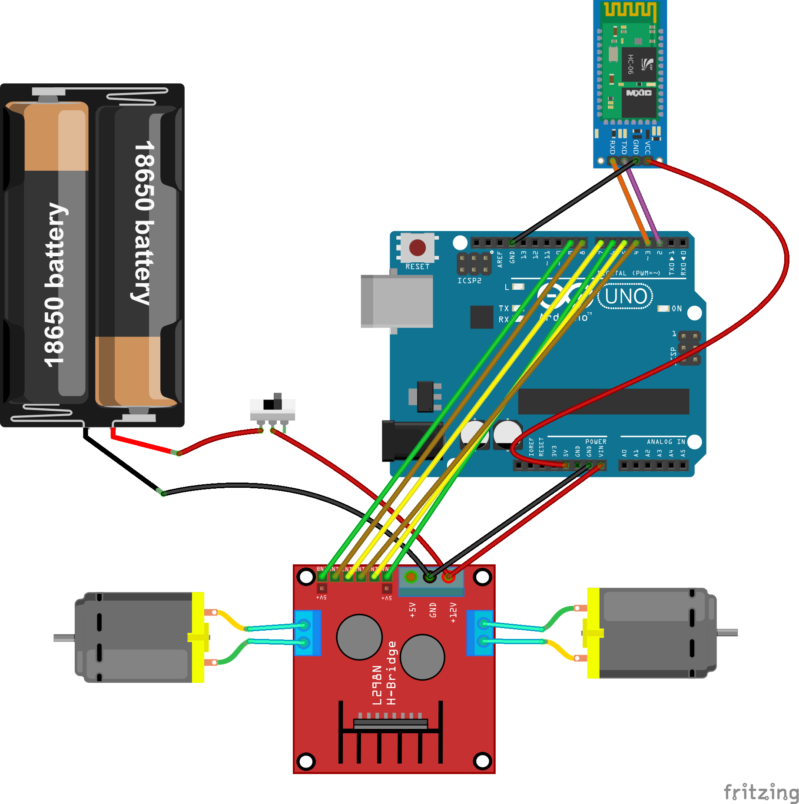

[← zpět na zápisky z Arduino projektů](../../index.md)
[← zpět na Robopixli](../robopixle.md)

# Robopixle ovládaná pomocí Bluetooth z Python konzole

## Co je potřeba umět
* Vrtat vrtačkou do kovové krabice :-)
* 

## Foto








## Video

<div markdown="0">
    <video controls>
        <source src="robopixle_bt.mp4" type="video/mp4">
        Bohužel, váš prohlížeč neumí HTML5 video. <a href="robopixle_bt.mp4">Přehrajte si jej jako soubor.</a>
    </video>
</div>

## Hardware
* kovová krabička od čaje
* 2 motory (Aliexpress, specifikace)
* 2 kola (Aliexpress)
* dual motor driver LN298N (Aliexpress, specifikace)
* Bluetooth modul, my jsme použili modul HC-06 (Aliexpress, specifikace)
* bateriové napájení, my jsme použili 2× Lion 18650 s držákem, který má i vypínač (Aliexpress)
* pro zabránění zkratu jsme použili korkovou podložku pod sklenici

## Jak to funguje
### Bluetooth
Jak už jsem zmínil, Bluetooth byla nouzová bezdrátová technologie, protože cílem bylo do večera daného dne zprovoznit bezdrátově Robopixli a infra sensor jsem upálil. Wifi modul ani jiné bezdrátové technologie nebyly zrovna po ruce.

Nejdříve je potřeba zařízení napárovat s počítačem, který ho bude ovládat. Párovali jsme s Linuxem, tedy jsme doinstalovali program TODO pro lepší správu Bluetooth zařízení.
``` bash
sudo apt-get install TODO
```
Párování proběhne standardním způsobem, Robopixli zapnout a počítačem hledat. Výchozí heslo modulu HC-06 je `1234`. 

TODO Tady asi trochu rozepsat, jak se to na tom linuxu páruje.

Používáme knihovnu [SoftwareSerial](https://www.arduino.cc/en/Reference/softwareSerial) - to proto, aby nebylo nutné při nahrávání kódu do Arduina odpojovat Bluetooth modul - ten totiž blokuje TX/RX piny a hádá se to. [SoftwareSerial](https://www.arduino.cc/en/Reference/softwareSerial) umožňuje Bluetooth připojit na jiné piny Arduina a provozovat sériovou komunikaci tam, je pak možné vše provozovat pohodlně najednou. 

Jen taková nápověda: RX pin Bluetooth modulu přijde zapojit na TX Arduina a TX Bluetooth na RX Arduina. Trochu nás to potrápilo, ale smysl to dává :-)

### Napájení
Krabice pro Robopixli není na výšku dostatečně vysoká, aby mohlo mít Arduino napájení přes konektor (ať už USB nebo jack). Bylo potřeba [prozkoumat jiné možnosti napájení přímo přes piny Arduina](https://www.arduino.cc/en/main/arduinoBoardUno). `-` z baterie jde tedy do `GND` a `+` jde do `Vin` pinu.

## Schéma zapojení
[robopixle_bt.fzz](robopixle_bt.fzz)

[](robopixle_bt_bb.png)

## Program pro Robopixli
[robopixle_bt.ino](robopixle_bt.ino)
``` c++

```

## Program pro ovládací Python konzoli
Program pro ovládání je velmi jednoduchý, páruje se automaticky na první zařízení, které na Bluetooth síti nalezne, vůbec neinteraguje s uživatelem, že by mu dával na výběr. Že je spárováno je možné poznat jak na displeji počítače (objeví se výzva k zadávání pohybových příkazů), tak na Robopixli, kde přestane blikat modrá LED Bluetooth modulu a začne trvale svítit.

Ovládání Robopixle probíhá pomocí jednoduchých příkazů sestávajících ze 4 písmen:
* `F` = forward (dopředu), pixle popojede kousek dopředu
* `B` = backward (dozadu), pixle popojede kousek dozadu
* `L` = left (vlevo), pixle se otočí asi o 90° vlevo
* `R` = right (vpravo), pixle se otočí asi o 90° vpravo
* Enter = odeslání sestavy příkazů Robopixli, ta je začne obratem provádět (připravte si místo na podlaze!)
Program se přerušuje pomocí `Ctrl+C`.

[robopixle_bt.py](robopixle_bt.py)
``` c++

```

## Možná vylepšení
Možných vylepšení je mnoho a [chystáme je](../robopixle.md).

## Poznatky
* Jak je nakonec z fotek vidět, je dobré si dopředu vše proměřit, zda se do krabice robopixle vejde. Nám to vyšlo tak tak. Uno je velké, motory také a o driveru motorů s velkým chladičem ani nemluvě.
* Kovová krabice je dobrá, ale mistr Farraday se nám smál, když jsme se snažili chytit nějaký signál. Bylo potřeba vyvrtat díru pro Bluetooth modul, aby mohla anténa čouhat ven.
* Motory jsou silné a je potřeba je pomocí PWM trochu brzdit.
* Kola nejsou přímo naproti sobě, takže to mírně zanáší, to lze trochu korigovat rozdílnou rychlostí kol.
* Motory nejsou krokové, takže lze zapomenout na přesný pohyb (robot neoběhne čtverec tak, aby se vrátil do původního místa). Kdyby byly krokové, byly by významně dražší a pomalejší, takže si musíme vybrat. Ukázalo se, že to asi nebude nikomu vadit, robot bude řešit jiný typ úloh.
* Napájení pomocí 2× Lion 18650 dá v plně nabitém stavu asi 8,4&nbsp;V, po nějakém větším trápení dětmi napětí rychle klesá k 7&nbsp;V, z toho si ještě odeberou motory, takže na Arduino zbývá už málo. [Pod 7&nbsp;V je Arduino Uno nestabilní](https://www.arduino.cc/en/main/arduinoBoardUno) (a v reálu se to projevuje tak, že to dělá blbiny, neposlouchá, neslyší a nechce slyšet).
