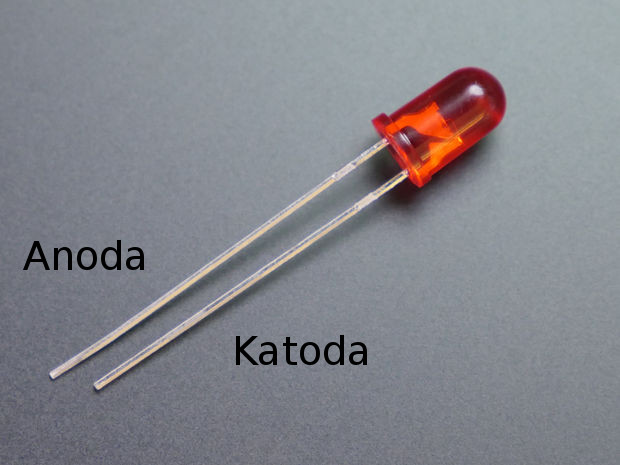
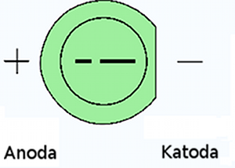
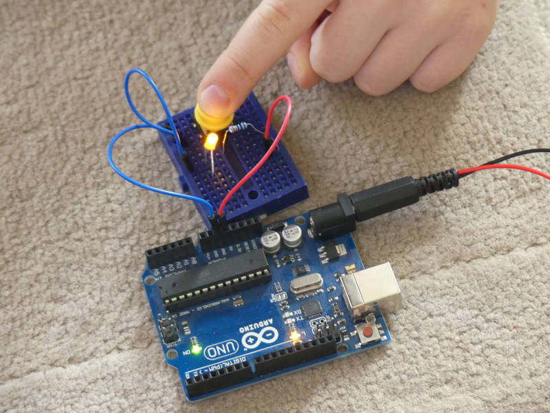

[← zpět na zápisky z Arduino projektů](../index.md)

# Ruční blikače
Základní osahání součástek. Osahání LEDek. Anoda, katoda. Mnemotechnické pomůcky pro rozlišení nožiček:
* "ANOda", kde ANO = kladné přitakání, tedy plus
* ta delší nožička, což znamená "více", tedy plus

* při pohledu shora může být jedna strana seříznutá, tedy "mínus"

No a pokud se netrefíte, tak se zase tolik nestane. LED nebude svítit, protože je dioda zavřená.

[Připojení LED přes rezistor](https://arduino.cz/proc-musim-u-led-pouzit-rezistor/) (pozor, ať se neusmaží i samotné Arduino, [max proudové zatížení digitálního pinu je 40 mA](http://playground.arduino.cc/Main/ArduinoPinCurrentLimitations)). Osahání si prototypovacího nepájivého pole, vysvětlení vnitřního zapojení pole (koleje s `+` a `-` u velkého, rozdíly u malého), doporučené barvy u vodičů.

Spínače. Úlohy na rozsvícení 1 LED spínačem. 2 LED 1 spínačem, každou zvlášť svým spínačem apod.

Základní kreslení schémat (tužka, papír).
## Co je potřeba umět
Prakticky nic. Začínáme. Neprogramujeme, jen zapojujeme.

## Foto

## Hardware
* _Tady nepotřebujeme nutně Arduino, jen je pak potřeba vymyslet nějak jinak napájení pole_
* Dostatek různě barevných LED, některé se asi spálí
* Rezistory 220&nbsp;Ω - 330&nbsp;Ω
* Spínače

## Schéma zapojení
[rucni_blikac.fzz](rucni_blikac.fzz)

## Program
Není potřeba. Arduino slouží nejvýše jako zdroj napájení pro pole.

## Možná vylepšení
* Pro rozsvícení LED potřebuji stisknout více spínačů najednou.
* Při hraní se součástkami je možné přihodit i multimetr a proměřit baterii, proměřit, kde je a kde není napětí v poli, které části vedou a které ne.

## Poznatky
Pro děti je to podstatně větší zábava než bych očekával a to i pro starší (8-9 let). Úlohy s paralelním/sériovým zapojením LED a spínačů už jsou pro mladší děti (6 let) už docela těžké.