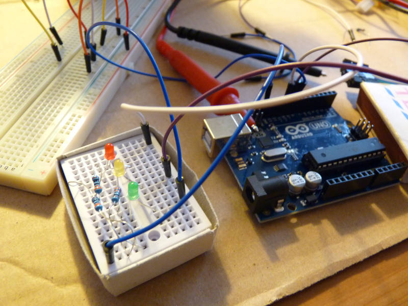
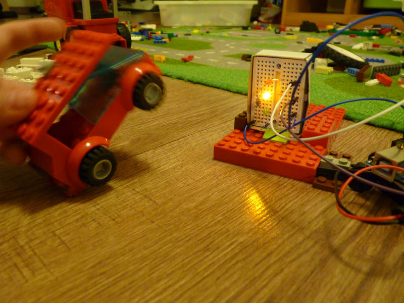
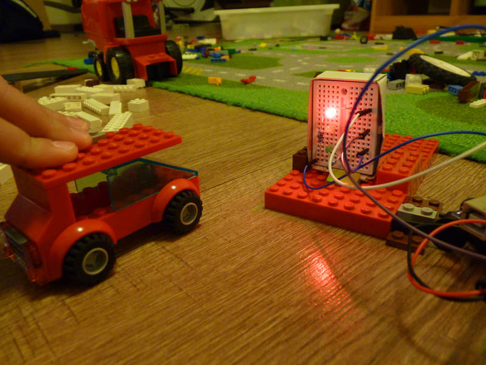
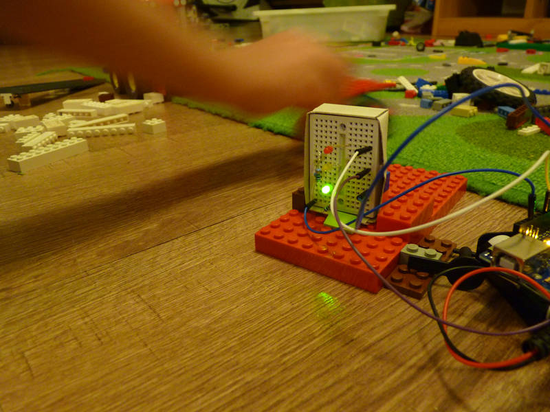
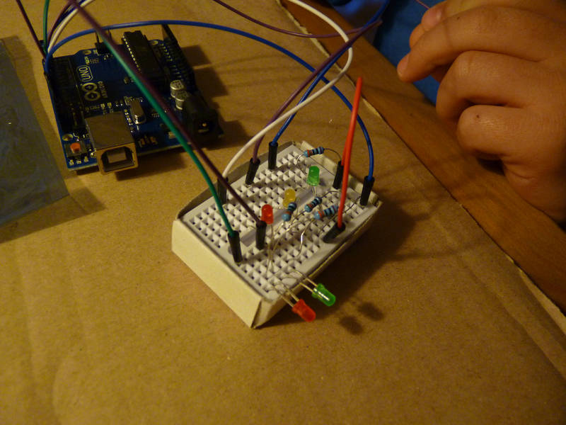
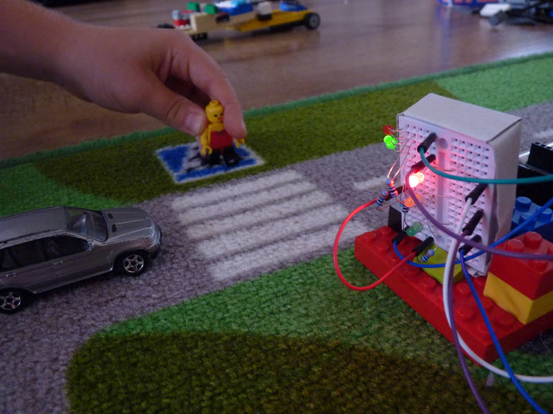
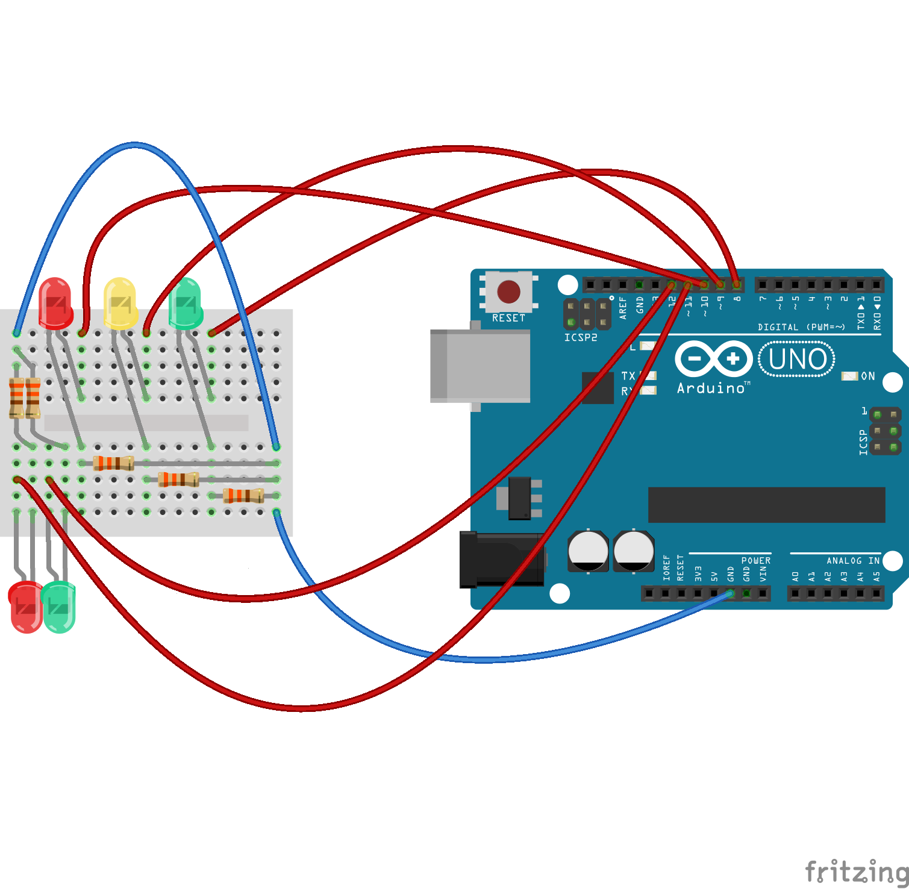

# Semafor
Pokročilejší úloha s využitím LED, samostatně vytvořit semafor. Míru samostatnosti lze regulovat (od zapojení HW přes napsání celého SW apod.) Abychom mohli snadno měnit intervaly pro jednotlivé barvy, zavedli jsme proměnné (v roli konstant). Pro lepší orientaci v kódu využíváme hojně komentáře.

## Co je potřeba umět
* zapojení, ovládání LED
* základní programové konstrukce (podmínky, hodí se i opakování), `HIGH`, `LOW`, `delay()` apod.

## Foto








## Video
<video width="1280" height="720" controls>
  <source src="semafor.mp4" type="video/mp4">
  Bohužel, váš prohlížeč neumí HTML5 video.
</video> 

## Hardware
* Zelené, žluté, červené LED
* Rezistory 220&nbsp;Ω - 330&nbsp;Ω

## Schéma zapojení
[semafor.fzz](semafor.fzz)



## Program
[semafor.ino](semafor.ino) - kód je napsán osmiletým dítětem, obsahuje různá vylepšení standardního semaforu viz níže
``` c++

```
## Možná vylepšení
* Doplnění klasického auto-semaforu ještě o semafor pro chodce.
* Doplnění semaforu(ů) o bezpečnostní chvíle, kdy svítí všude červená (pro přeběhlíky).
* Doplnění semaforu(ů) o blikání před koncem zelené (upozornění, že brzy skočí červená).
* Pro železniční nadšence je možné vyrobit např. nějaké [návěstidlo](https://www.google.com/search?q=odjezdov%C3%A9+n%C3%A1v%C4%9Bstidlo&client=firefox-b&source=lnms&tbm=isch&sa=X&ved=0ahUKEwjeoaqExufSAhVlIpoKHaayDeIQ_AUICCgB&biw=1600&bih=793#tbm=isch&q=odjezdov%C3%A9+n%C3%A1v%C4%9Bstidlo+barvy&*&imgrc=).
* Pro formulové nadšence je možné vyrobit [startovací světla](https://www.google.com/search?q=odjezdov%C3%A9+n%C3%A1v%C4%9Bstidlo&client=firefox-b&source=lnms&tbm=isch&sa=X&ved=0ahUKEwjeoaqExufSAhVlIpoKHaayDeIQ_AUICCgB&biw=1600&bih=793#tbm=isch&q=formula+start+lights&*).

## Poznatky
Zajímavá úloha pro procvičení samostatnosti, protože jak funguje semafor ví každé dítě, takže zadání není třeba příliš vysvětlovat. S výsledkem si lze navíc i vyhrát, pokud se využije malé nepájivé pole a nacpe se do krabičky od zápalek, je celé řešení celkem kompaktní. Mladší děti konči u standardního semaforu, starší ho šperkují.