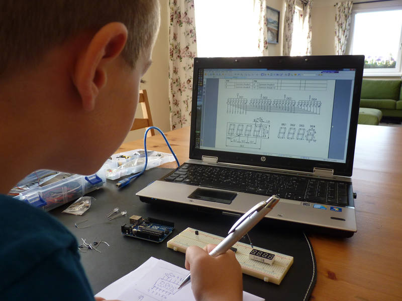
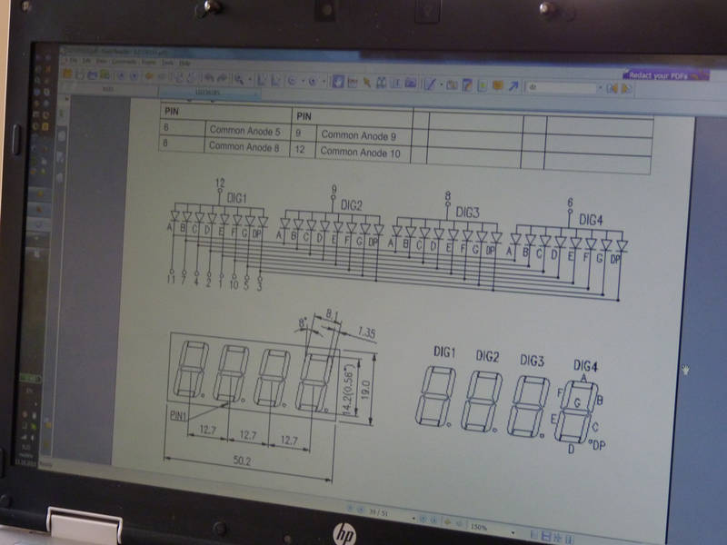
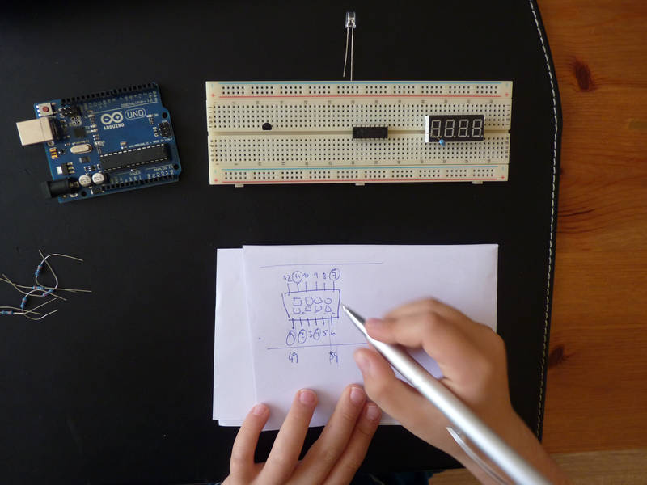
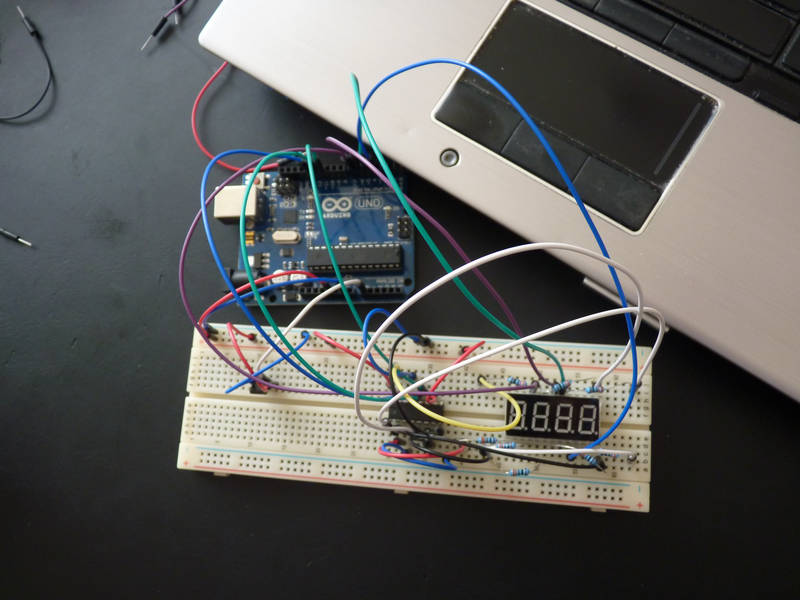
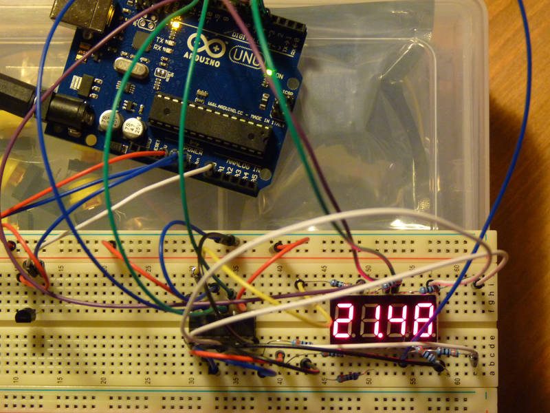

[← zpět na zápisky z Arduino projektů](../index.md)

# Teploměr
Teploměr pro měření teploty vzduchu se zobrazováním hodnoty na segmentovém displeji. Celkem náročnější úloha, záleží, kolik nových věcí najednou se dítě učí. Pokud je vše nové, tak to může být opravdu těžké (segmentový displej, posuvný registr, teploměr). Je možné provést jednoduchou variantu pouze s teploměrem, který vypisuje hodnoty např. na konzoli. A nebo kombinovat s jiným typem displeje (jednodušší ovládání).

## Co je potřeba umět
* Násobení, dělení.
* HW: Základní zapojování LED, rezistorů. 
* SW: Je dobré rozumět cyklům, hodí se znát operátor pro zbytek po dělení (modulo), rozumět polím, procedury.

## Foto







## Hardware
* teploměr LM35 ([Aliexpress](https://www.aliexpress.com/wholesale?catId=0&initiative_id=SB_20170323042709&SearchText=LM35), [specifikace](lm35.pdf))
* 4 číslicový 7 segmentový displej (použili jsme 3461BS, [Aliexpress](https://www.aliexpress.com/wholesale?catId=0&initiative_id=SB_20170323042741&SearchText=3461BS), [specifikace](LD3361BS.pdf))
* Posuvný registr 74HC595 ([Aliexpres](https://www.aliexpress.com/wholesale?catId=0&initiative_id=&SearchText=74HC595), [specifikace](SN74HC595.pdf))
* 8 rezistorů 220&nbsp;Ω - 330&nbsp;Ω

## Jak to funguje

### Teploměr LM35
Parametry:
* rozsah od −55°&nbsp;C do 150&nbsp;°C
* přesnost 0,5&nbsp;°C (při 25&nbsp;°C)
* vstupní napětí od 4&nbsp;V do 30&nbsp;V
* nízké sebezahřívání (0,08&nbsp;°C, pokud se tedy nezapojí obráceně ;-) )

Teploměr má 3 nožičky, napájení po stranách (`+Vs`, `GND`) a&nbsp;výstupní hodnotu na `Vout`. Ve specifikaci jsem napoprvé nějak přehlédl popisek k&nbsp;rozložení nožiček a&nbsp;zapojil jsem obráceně polaritu. Naštěstí jen na chvíli.


Při pohledu _zespodu_ je `+Vs` vlevo a&nbsp;`GND` vpravo :-) Hodnota `Vout` pak uprostřed.

Teploměr vrací 10&nbsp;mV/°C, rozsah analogového vstupu Arduina je 0-5V, vzorkovaných do 1024 hodnot. Z analogového pinu přečteme hodnotu, tu je nejdříve potřeba přepočítat na napětí, které vrací teploměr. 
```
napětí na výstupu teploměru = analogový pin vrací /1024 * 5.0
```
protože teploměr vrací 10&nbsp;mV na 1&nbsp;°C, převedeme dále
```
teplota = napětí na výstupu teploměru / 0,01
```
výsledný přepočet je pak
```
teplota = (analogový pin vrací /1024 * 5.0) / 0,01
```
nebo také [podstatně slavnější rovnice](http://playground.arduino.cc/Main/LM35HigherResolution)
```
teplota = (5.0 * analogový pin vrací * 100.0) / 1024;
```
Pokud bychom chtěli zvýšit trochu přesnost teploměru, snížíme referenční napětí z 5&nbsp;V na 1,1&nbsp;V. Teploměr tak bude měřit pouze v rosahu 0-110&nbsp;°C, ale s přesností na desetinky - tedy v rámci možností, protože sám LM35 má přesnost 0,5&nbsp;°C. Výpočet pak vypadá takto:
```
teplota = (1.1 * analogový pin vrací * 100.0) / 1024;
```
V kódu je pak potřeba v metodě `setup()` nastavit `analogReference(INTERNAL)`.

### Segmentový displej
Jde o hromadu LED, které jsou uspořádány do nějakého obrazce. Obvykle hovoříme o 7 segmentovém displeji (ale vlastně je 8 segmentový, protože máme tečky). Obvykle má displej kromě napájení piny, kterými vybíráme, kterou číslici chceme zrovna napájet. Tady se displeje dělí na 2 druhy - se společnou katodou a společnou anodou. Tedy je nejdříve potřeba zjistit, jaký displej držíme v ruce, podle toho pak bude zapojení a programování vypadat. 

3461BS je segmentovka se společnou anodou (ve [specifikaci](LD3361BS.pdf) je to strana 39). To znamená, že výběrový pin přivádí `HIGH` a na druhý konec vybraných LED potřebujeme přivést `LOW`, aby se rozsvítily respektive `HIGH`, aby ne (u displeje se společnou katodou je to právě naopak). Protože Arduino nemá tolik pinů, využijeme posuvný registr, který vždy nejdříve nakrmíme všemi nulami a jedničkami pro jednotlivé LED a následně ho necháme, aby je pro nás rozsvítil.

Tady jen poznámka ke kódu níže - v konstantě pro jednotlivé číslice máme, že hodnota 1 = LED svítí, ale výše jsem uvedl, že aby svítila, musí mít na jednom svém konci `HIGH` a na druhém `LOW`. A protože naše LED už `HIGH` na svou anodu "dostaly", musíme jim pro rozsvícení dodat `LOW`. Tedy nulu do posuvného registru. Proto se v kódu objevuje [binární negace](https://www.arduino.cc/en/Reference/BitwiseXorNot) v podobě `~`, která nám přehodí všechny 0 na 1 a obráceně. Pro displeje se společnou katodou to není potřeba.

**Pozor i 7 segmentový displej vyžaduje zapojení před rezistory!**

### Posuvný registr 74HC595
Posuvný registr nám dovoluje obsluhovat např. více LED než máme na Arduinu pinů. Zjednodušeně do něj nacpeme seriově potřebné informace a pak mu dáme signál, že to má najednou (paralelně) přenést na své datové výstupy (LED). 


Podrobněji: na vstupu máme 3 nožičky:
* data (pin 14) - data, tudy posuvný registru předáváme informace
* clock (pin 11) - časování, tady se posuvný registr dozví, že by měl číst z datového pinu, po každém čtení si informaci zapamatuje
* latch (pin 12) - závora, která při přechodu na z `LOW` → `HIGH` přepíše paměť registru na výstupní datové piny registru

Na výstupu pak máme 8 datových nožiček (pin 1-7 + 15), na které se přenáší paměť registru při zvednuté závoře. Napájení jsou piny `GND` + `OE` → `GND`, `Vcc` + `MR` → +5&nbsp;V.

Pro vlastní plnění posuvného registru využíváme metodu Arduina [shiftOut](https://www.arduino.cc/en/Reference/ShiftOut). Té předáváme datový pin, kudy tlačíme data, clock pin, kde bude Arduino posuvný registru "tikat", aby veděl, kdy má data číst, jestli začínáme nejméně významným bitem nebo nejvíce významným bitem a vlastní přenášenou hodnotu. 

Jen malé upozornění pro další pokusy s posuvným registrem, najednou z něj lze tahat asi maximálně 70&nbsp;mA. Více se dá dočíst v pěkném [povídání v angličtině](https://www.arduino.cc/en/Tutorial/ShiftOut).

## Schéma zapojení
[teplomer.fzz](teplomer.fzz)
Zapojení kreslilo 7 leté dítě :-)


## Program
[teplomer.ino](teplomer.ino)
``` c++

```
## Možná vylepšení
* Zvýšení přesnosti teploměru změnou referenčního napětí z 5&nbsp;V → 1,1&nbsp;V.
* Přidávání dalších informací, které by se na segmentovém displeji mohly zobrazovat (písmenka).
* Protože ovládání segmentového displeje je celkem komplikované, je možné zkusit jiný typ displeje, např. LCD nebo OLED.

## Poznatky
Nejvíce asi zabralo vysvětlování toho, jak jsou ty LED uspořádány uvnitř segmentového displeje. Pak samozřejmě posuvný registr a nějak se poprat s bitovými operacemi (ale ty se dají obejít tím, že uděláme bitový zápis v kódu a nepřevádíme mezi soustavami). A pak samozřejmě ta nehoda s teploměrem... ;-) Celkově je to náročnější úloha, která se nemusí stihnout ani za jedno odpoledne, pokud jsou všechny ty věci nové.
