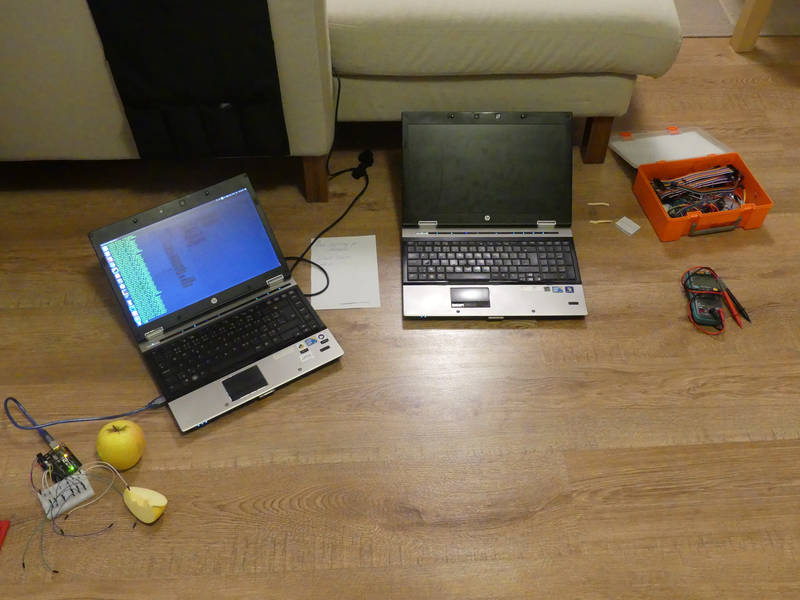
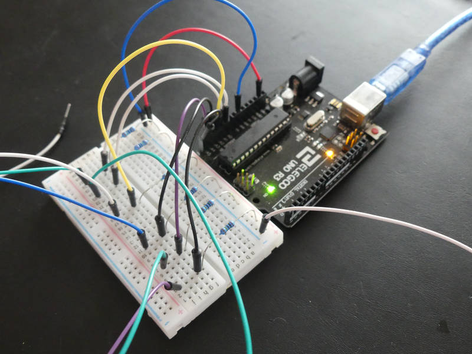
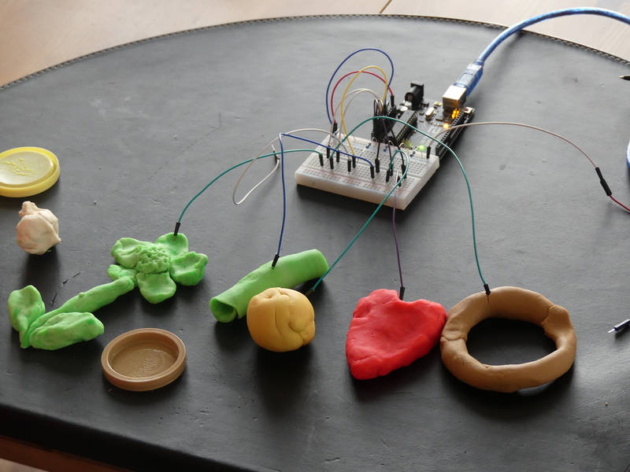
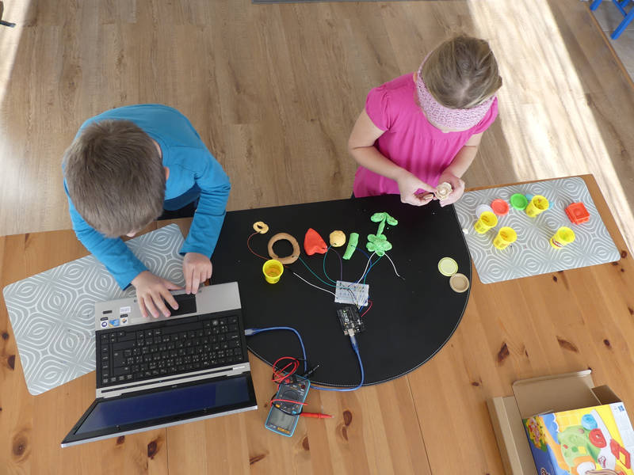
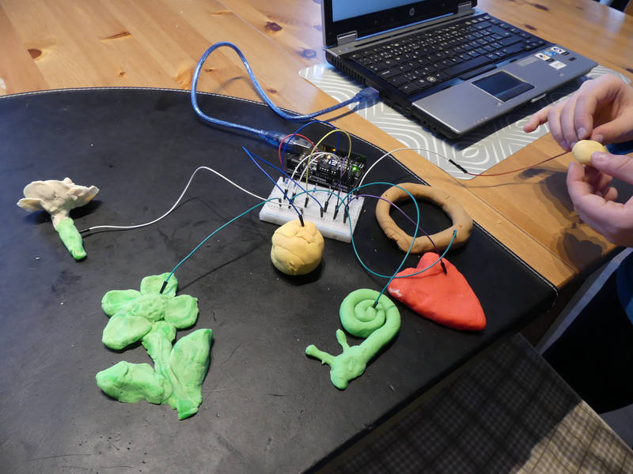
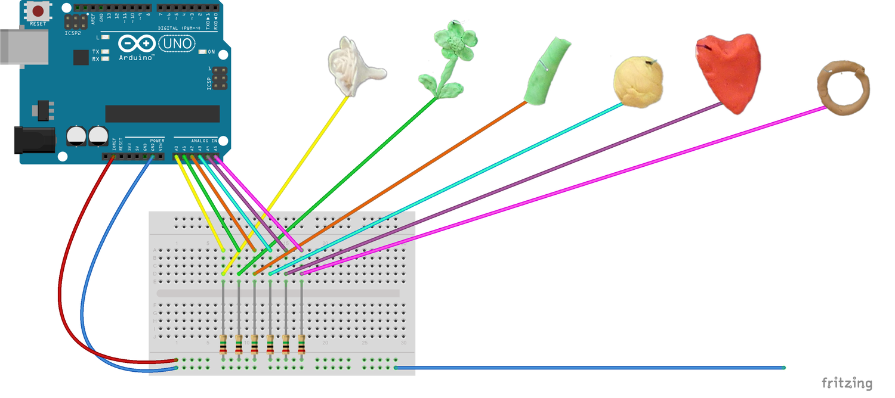
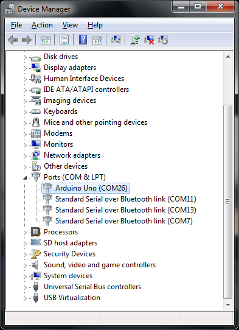
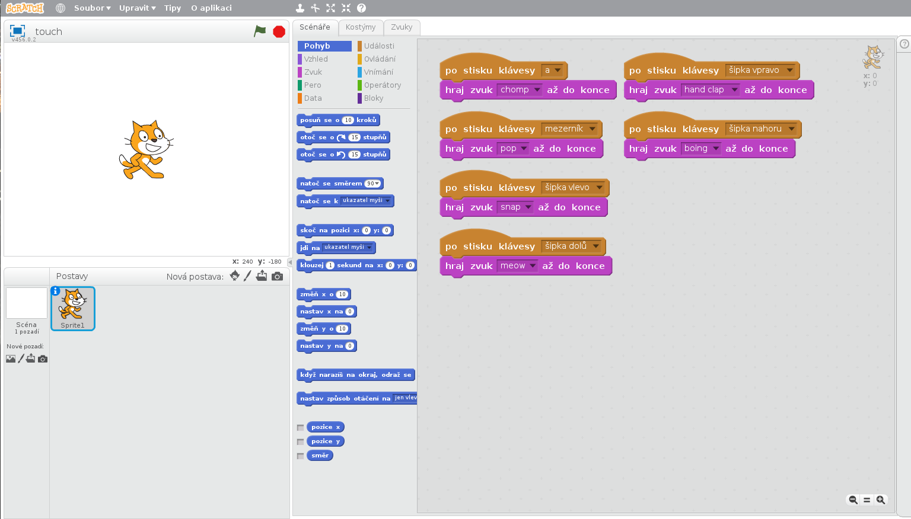

[← zpět na zápisky z Arduino projektů](../index.md)

# Touchduino
* obsah
{:toc}
{::options toc_levels="2..4" /}

Tak pojmenovaly tento projekt děti. Naše domácí verze mnohem slavnějšího [Makey Makey](https://www.makeymakey.com/). Jde o jednoduchý obvod s detekcí uzavřené smyčky a generováním kláves v počítači.

Bohužel, běžná Arduina se nechovají jako `HID` [(Human Interface Device)](https://en.wikipedia.org/wiki/USB_human_interface_device_class), to umí jen méně časté verze jako třeba [Leonardo, Micro či Due](https://www.arduino.cc/en/Reference.MouseKeyboard). Taková se nám doma neválí, tedy jsme si museli nějak poradit.

## Co je potřeba umět
Určitě je výhodou se alespoň trochu orientovat v Pythonu, hlavně v instalaci knihoven.

## Foto
První pokusy 


Tady už řádí děti  



## Video
<div markdown="0">
    <video controls>
        <source src="touchduino.mp4" type="video/mp4">
        Bohužel, váš prohlížeč neumí HTML5 video. <a href="touchduino.mp4">Přehrajte si jej jako soubor.</a>
    </video>
</div>

## Hardware
* 6× 2&nbsp;MΩ rezistor (Arduino Uno má 6 analogových pinů)

## Jak to funguje
Propojili jsme Arduino Uno (ale lze vzít jakýkoli kontroler, který neumí HID) přes seriové rozhraní s počítačem, kde na něj čeká Python skript. Ten následně generuje klávesy v systému, jako by byly stisknuty na klávesnici. Klávesy pak lze zachytit v libovolném programu, např. ve [Scratchi](http://scratch.mit.edu/), ve kterém se děti často učí programovat a mohou si tak vyhrát např. se zvuky. Výsledek jsme otestovali na Windows tak i na Linuxu. Jako "tlačítka" děti použily modelínu.

## Schéma zapojení
[touchduino.fzz](touchduino.fzz)

[](touchduino_bb.png)

## Program Arduino
Hodnota `900` pro uzavřenou smyčku byla zjištěna experimentálně.

[touchduino.ino](touchduino.ino)
``` c++

```

## Python simulátor klávesnice
Protože Arduino Uno neumí samo simulovat klávecnici (není [HID](https://en.wikipedia.org/wiki/USB_human_interface_device_class)), napsal jsem jednoduchý skript v jazyce Python, který se připojí na seriovou linku na zadaném portu, čte příkazy poslané Arduinem a následně simuluje stisknuté klávesy.
### Prerekvizity
1. Nainstalován [Python 3](https://www.python.org/downloads/)

    Verzi Pythonu lze zjistit
    ```shell
    python --version
    Python 3.6.0
    ```
    Další podrobnosti k instalaci třeba v [tomto pěkném manuálu](https://tutorial.djangogirls.org/en/python_installation/). Někdy běží souběžně verze 2.x i 3.x, pak je potřeba pouštět python 3 např. jako ; `python3`.
2. Na **Linuxu** postačí nainstalovat knihovny `PySerial` a `PyUserInput`:

    ``` shell
    pip install pyserial
    pip install pyuserinput
    ```
3. Na **Windows** je potřeba trochu více, protože knihovna `PyUserInput` pro Windows vyžaduje dále `PyHook` a `PySerial` vyžaduje pro přístup k portům  `Pypiwin32`.

    `PyHook` se mi podařilo nainstalovat z [balíčku wheel](https://www.lfd.uci.edu/~gohlke/pythonlibs/#pyhook) (pozor, až budete tento návod číst, může být již novější verze). 
    ```shell
    pip install pyHook-1.5.1-cp27-none-win32.whl
    ```    
    Pypiwin32 pak standardní cestou.
    ```shell
    pip install pypiwin32
    ```
    Co se mi však nedařilo pro nekompatibilitu verzí Python, byla instalace samotného `PyUserInput` na Windows, nakonec jsem stáhl [přímo zip](https://github.com/PyUserInput/PyUserInput)  (clone or download, download zip) a po rozbalení provedl ruční instalaci.
    ```shell
    python setup.py install
    ```

### Program Python simulující stisky kláves
[arduino_keyboard.py](arduino_keyboard.py)
``` python

```

### Jak to pustit
Python simulátor klávesnice pustíme z příkazové řádky, očekává jediný parametr a tím je označení portu, na kterém si bude s Arduinem povídat.

Postup, jak zjistit, na jakém portu se ním Arduino usídlilo, se liší podle operačního systému.

#### Linux
``` shell
ls -l /dev/tty*
```
nebo ještě lépe
``` shell
dmesg | tail
```
Vlastní spuštění pak vypadá takto:
```shell
python arduino_keyboard.py /dev/ttyACM0
```

#### Windows
Control panels, Device Manager, Ports (COM & LPT)



Vlastní spuštění pak vypadá takto:
```shell
python arduino_keyboard.py COM26
```

Skript čte ze zadaného sériového portu, kam mu Arduino posílá příkazy. Co přichází, vypisuje na konzoli, pokud něčemu porozumí, píše, jaké klávesy generuje. Ukončit jej lze např. pomocí `Ctrl+C`.

> **Pozor**, upravili jsme Python skript tak, aby místo klávesy `Enter` posílal klávesu `a`. Scratch si s klávesou `Enter` neporadí a neumí ji zpracovat.

## Program Scratch
Ve chvíli, kdy nám Arduino "generuje" klávesy na počítači, pro zbytek zábavy postačí Scratch, ve kterém si děti už nějaký program samy vymyslí.  Čím hlasitější, tím lepší.

[touchduino.sb2](touchduino.sb2)



## Možná vylepšení
* Samozřejmě hlavním vylepšením jsou ["krokodýlci"](https://www.aliexpress.com/wholesale?ltype=wholesale&d=y&origin=y&blanktest=0&SearchText=crocodile+wires&tc=af&initiative_id=SB_20171203133207&isViewCP=y&catId=0), které ale zatím doma nemáme, časem.
* Je možné vyzkoušet různé hry, kdy je potřeba na něco či někoho sáhnout.
* Hra na modelínové piano.
* Pokud má váš kontroler více analogových pinů, lze udělat více vstupů.
* Lze si zkusit přidat další vstupy pomocí multiplexeru, např. pěkného 16 kanálového [CD74HC4067](https://www.aliexpress.com/wholesale?ltype=wholesale&d=y&origin=y&blanktest=0&SearchText=CD74HC4067&tc=af&initiative_id=SB_20171203131846&isViewCP=y&catId=0).

## Poznatky
* Pokud sedím na zemi, jsem více uzemněn a může se tak stát, že k tomu, aby Arduino detekovalo uzavřenou smyčku, nebude potřebovat své `GND`, postačí mu má sedací plocha.
* Notebook napájený ze sítě je více uzemněn než notebook provozovaný na baterii.
* Experimentovali jsme i s různým ovocem, banány, jablka...
